# Manual personal de C++
## Índice 

1. [Instalación](#id1)
2. [Primer progrma](#id2)
3. [Elementos de un programa](#id3)
4. [Tipos de datos y varibles](#id4)
5. [Introducir dato desde la terminal](#id5)
6. [Constante](#id6)
7. [Array](#id7)
8. [Array bidimensional](#id8)
9. [Arrays multidimensionales](#id9)
10. [Vectores](#id10)
11. [Operadores](#id11)
12. [](#id12)
13. [](#id13)
14. [](#id14)
15. [](#id15)
16. [](#id16)
17. [](#id17)
18. [](#id18)
19. [](#id19)
20. [](#id20)


## Instalación <div id="id1"></div>
Necesitamos instalar la extension de C/C++ de VScode
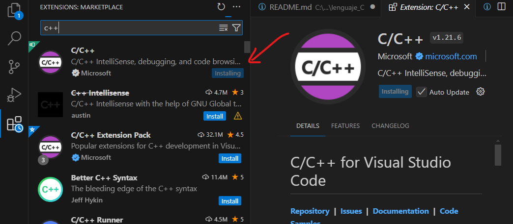
Si utilizamos windows necesitamos instalar el compilador.

Comprobar si tenemos instalado el compilador y que versión.
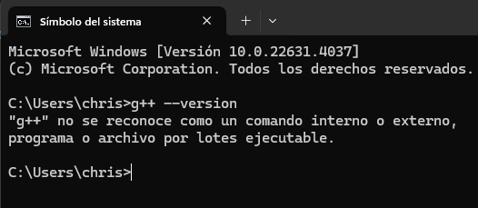
El compilador que tenemos que instlar es: **MinGW-w64**
Nos dirigimos a la página oficial. 
[https://www.mingw-w64.org/](https://www.mingw-w64.org/) 
Descargas. 

Tenemos que instalr el programa MSYS2.

Seleccionamos la opción: MSYS2
Descargamos el instalador y lo ejecutamos.

Se nos acaba de instalar un entorno unix junto con el compilador gcc
En la terminal que acabamos de instalar. 

Vamos a instalar el compilador gcc.
copiando el siguiente comando:

`
pacman -S mingw-w64-ucrt-x86_64-gcc
`
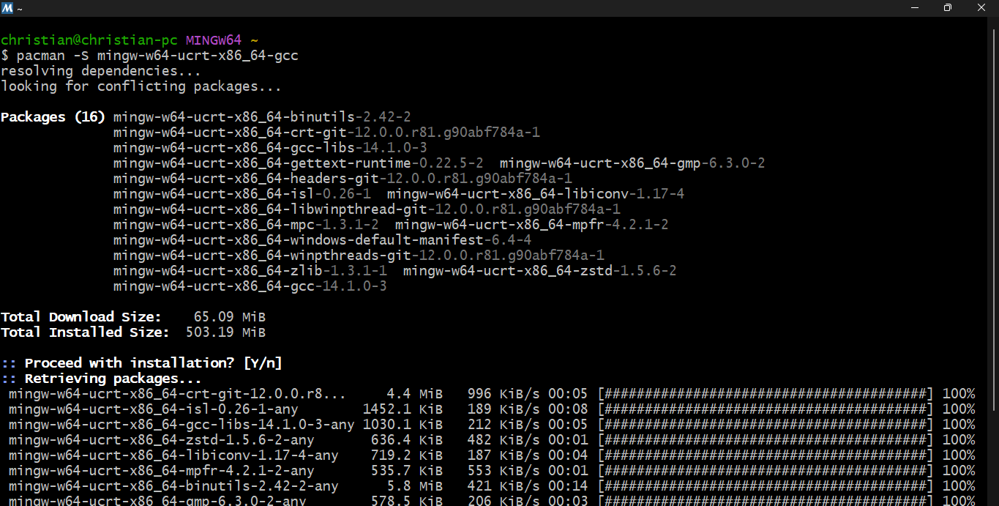
Ya lo tendriamos instalado.
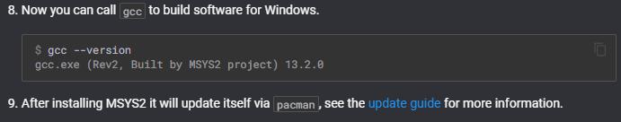

Acontinuación tenemos que actualizar los paquetes. 
Cerramos esta terminal y abrimos la terminal MSYS2 MSYS buscandola en el menu de windows.

Introducimos el comando: 

`
pacman -Suy
`

Seguido del comando: 

`
pacman -S --needed base-devel mingw-w64-x86_64-toolchain
`

Nos da la opctión de seleccionar que queremos instalar. 
En nuestro caso vamos a seleccionar todos introduciendo enter.

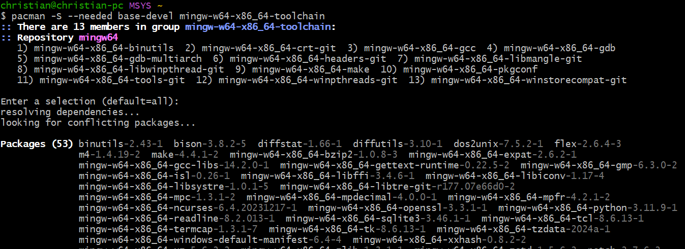

Ya hemos terminado de instalr todo.

Cerramos la terminal y la volvemos a abrir.

Comprobamos la versión instalada.
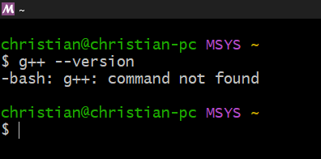

Esto no significa que no esté instalado. Si no que no está añadido al path. Es decir, no sabe donde está este programa. 

Nos dirijimos en el explorador de archivos a: Este esquipo / Windows (C:) / msys64  / mingw64 / bin 

Aqui se encuentra g++

Copiamos esta ruta: C:\msys64\mingw64\bin

En el buscador de windows ponemos: path

Abrimos: Editar las varibles de entorno del sistema

Opciones avanzadas -> varibles de entorno

En path editamos

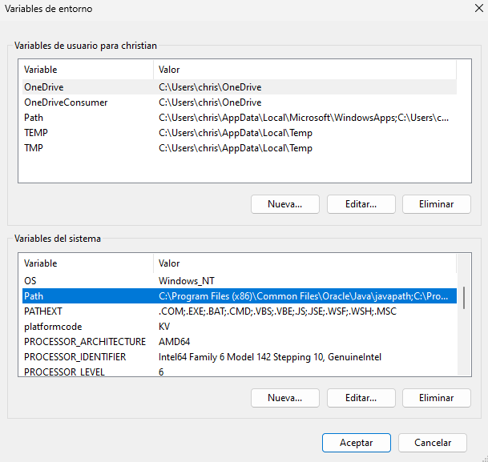
Pulsamos en nuevo
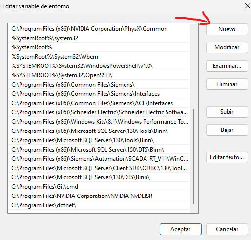
Pegamos la ruta anterior y aceptar. 
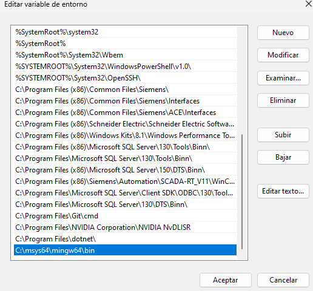
Al comprobar de nuevo la versión.
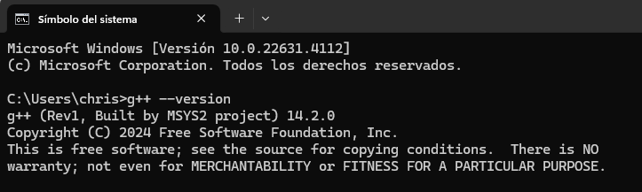
Con esto ya hemos finalizado completamente la instalación del compilador gcc.


## Primer progrma <div id="id2"></div>

Escribimos un Hola mundo.
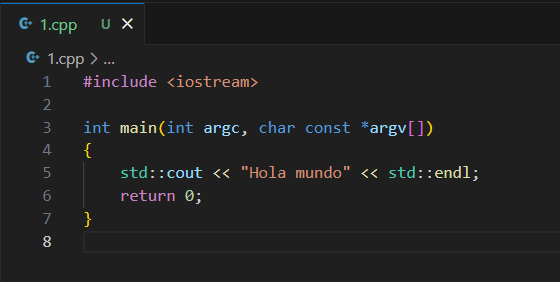

Pulsamos F1 y escribimos: integrated terminal 
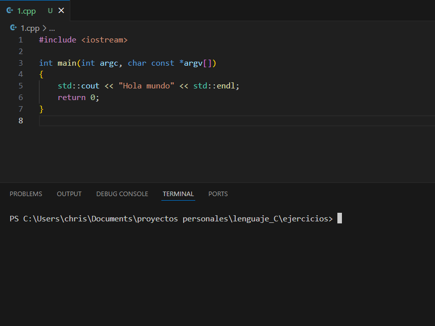

Nos dirigimos a la dirección donde se encuentra nuestro archivo .cpp en la terminal y escribimos:

`
c++ nombre_del_archivo.cpp -o hola_mundo.exe
`

-o significa asignarle una salida.


Acontinuación ejecutamos el ejecutable que se nos ha creado. Introduciendo: 

`
/hola_mundo.exe
`

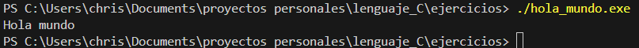

De esta forma hemos creado, compilado y ejecutado nuestro primer progrma.

### Extensión code runner 

Vamos a instalar una extensión a Visual Studio Code para compilar y ejecutar directamente nuestro código apretando un botón.

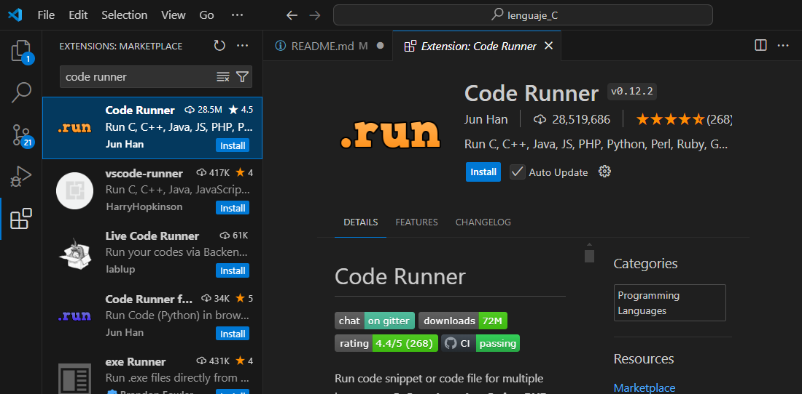

Apretando este boton el ejecuta las órdenes de la terminal por nosotros.

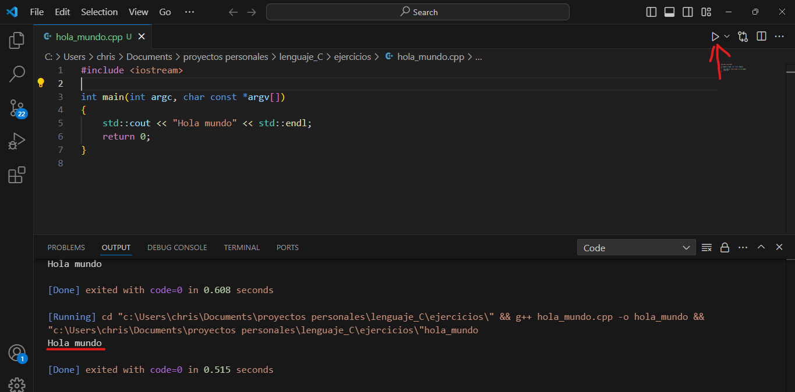

## Elementos de un progrma <div id="id3"></div>

```C++
#include <iostream>
using namespace std;

int main()
{
    cout << "Hola mundo" << endl;
    return 0;
}
```

```C++
#include <iostream>
```
Biblioteca

Incluye todo un conjunto de clases y funciones que pueden ser llamadas en el programa. Entre ellas la función count.

```C++
unsing namespace std;
```
Sentencias o declaraciones.
Indica que vamos a utilizar el espacio de nombres std.

En este caso la biblioteca std contiene a la función iostream

**Espacios de nombres**
Conjunto de funciones que contienen una biblioteca.
Sirve para evitar los conflictos de nombres.

```C++
int main()
```
Funcion principal. 
Secuencia de instrucciones que se ejecutan de arriba a abajo.

>Todo progrma empieza a ejecutarse en la primera línea de la función main.
Y termina con la última línea que contienen las llaves de la función main.

```C++
cout << "Hola mundo" << endl;
``` 
Character out. Sacar por consola un mensaje.
**endl** Es un salto de línea.

```C++
return 0;
```
Las funciones siempre nos devuelven un valor. Excepto las funciones del tipo void.

## Tipos de datos y variables <div id="id4"></div>

### Caracteres
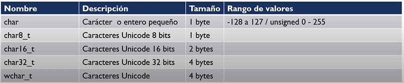

Carácteres o enteros pequeños.

Enteros con signo del -128 al 127.

Enteros sin signo del 0 al 255.

### Enteros
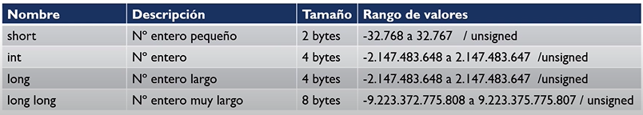

Pueden ser sin signo. En este caso el valor se duplica.

### Decimales
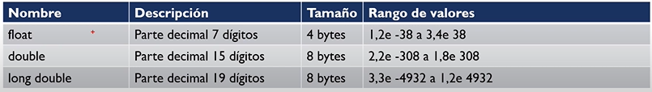

Por ejemplo en un floal son: 38 decimales a la derecha y 38 decimales a la izquierda.

### Booleanos

Se puede sustituir por 0 o 1.

### Variable

Espacio en la memoria donde se almacena un valor que puede variar.

Se almacena en la memoria RAM. 
Al apagar el ordenador se borra.

>C++ Es un lenguaje fuertemente tipado.

Es necesario especificar de que tipo es esa variable.

Las variables siempre se deben declarar antes de utilizarlas.

### Eemplo

Para declarar una variable. 2 opciones.
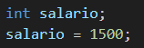

Primero declarar la varible.

Lego inicializarla (Asignarle un valor).

Útil si en el momento de declararla todavía no tenemos claro que valor le vamos a asignar.

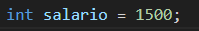

O declararla e inicializarla a la vez.

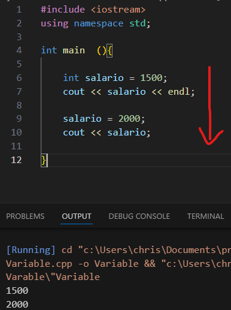

En este ejemplo se ve como el flujo del progrma va de arriba a abajo.

**C++ es case sensitive.**

Es decir, la variable **C**asa y **c**asa, son dos varibles diferentes. Afectan las mayusculas y minúsculas al nombre de la variable. 

## Introducir dato desde la terminal <div id="id5"></div>
El usuario da un valor a una variable a través de la consola.

```c
cin >> salario;
```
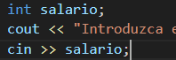

primero declaramos la varibale entero salario, Sin darle un valor (inicializarla).

Porsteriormente asignamos el valor a través de la la función **cin**, escribiendo el valor en la consola y pulsando enter.

## Constante<div id="id6"></div>
Una constante almacena un valor que **no puede cambiar.**

Se deben declarar e inicializar al mismo tiempo.

Tipos de constantes:

### Literales

**Expresiones o secuencias de escape**

**/n** Salto de línea

**/t** Tabulación

**/b** Espacio horizontal

### Declaradas
Dispone de la palabra reservada const
```C++
Const double iva = 0.21;
```
### Expresiones constanstes 

### Constantes enumeradas

### Definidas
Uso obsoleto.

```c++
#define double iva = 0.21;
```


## Array<div id="id7"></div>
Estructura que contienen varios valores del mismo tipo.

Almacena valores que tienen algo en común.

Una vez declaramos el array, no podemos modificar el número de elementos que contiene. Pero si el valor de cada uno de ellos.

### Declaración e inicialización

Varias formas:


```c++
int mi_array [5]{15,25,8,-7,92};
```

Array de enteros, de longitud 5 y con estos valores: **15 25 8 -7 92**

```c++
int mi_array [5]{15,25};
```

Array de enteros, de longitud 5 y con estos valores: **15 25 0 0 0**

```c++
float mi_array [5]{2.5};
```

Array de floats, de longitud 5 y con todos los valores iguales: **2.5 2.5 2.5 2.5 2.5**

```c++
int mi_array []{2,7,8,7,5,1};
```
No indicamos la longitud del array. Esta es tomada de la cantidad de valores introducidos.

Array de enteros, de **longitud 6** y con estos valores: **2 7 8 7 5 1**

### Declaración e inicialización por separado

El array empieza en la posición 0.

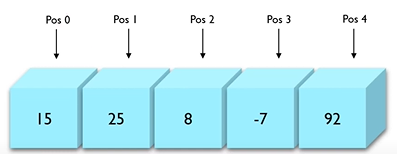

```c++
// Declaración
int mi_array [5];

//Almacenamiento
mi_array[0]=15;
mi_array[1]=28;
mi_array[2]=8;
mi_array[3]=-7;
mi_array[4]=92;
```

Para acceder al los valores de las diferentes posiciones:

```c++
//Acceso
mi_array[0];
mi_array[1];
mi_array[2];
mi_array[3];
mi_array[4];
```

### Sobrescritura
Modificación del valor de un elemento del array. Siempre introduciendo un valor del mismo tipo que el array.

```c++
mi_array[4]=88;
```
## Array bidimensional<div id="id8"></div>

Array que en cada una de su posición se desdobla e incluye otro array.
Contiene dos índices.
#### Array mono dimensional

#### Array bidimensional
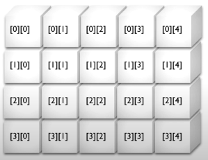

### Declaración e inicialización 

Dos formas.

```c++
int mi_array[4][5]={15,25,8,-7,92,77,12,11,7,44,56,59,43,78,12,43,95,12,87,33};
```
```c++
int mi_array[4][5]={
    {15,25,8,-7,92},
    {77,12,11,7,44},
    {56,59,43,78,12},
    {43,95,12,87,33}
    };
```
Multiplicamos los íncides para obtener el número de elementos que contiene ele array.
4 x 5 = 20.

### Almacenamiento individual 

```c++
//Almacenamiento
mi_array[0][0]=15;
mi_array[0][1]=25;
mi_array[0][2]=8;
mi_array[0][3]=-7;
mi_array[0][4]=92;
```
Previamente tenemos que declarar el array.

### Acceso

```c++
//Acceso
mi_array[0][0]
```

Normalmente, el array bidimensional se declara y su contenido es escrito mediante dos bucles for anidados. 
Uno recorre las filas y otro las columnas.

En el siguiente ejemplo. Introducimos un array por consola, para finalmente imprimirlo en pantalla.

```c++
#include <iostream>
using namespace std;

int main (){
    //Declaración del array bidimensional
    int array_bidimensional[3][3];

    cout << "Introduce cada valor" << endl ;

    //Dos bucles for anidados para introducir los valores por consola
    for (int fila=0; fila<3; fila++){
        for (int columna=0; columna<3; columna++){
            cin >> array_bidimensional[fila][columna];
        }

    }
    cout << "Array bidimensional introducido:" << endl ;

    //Dos bucles for anidados para imprimir los valores 
    for (int a=0; a<3; a++){
        for (int b=0; b<3; b++){
            cout<< array_bidimensional[a][b]<< " ";
        }
        cout<< endl;

    }
}
```
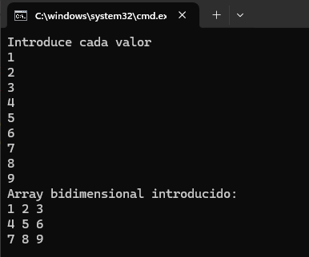


## Arrays multidimensionales<div id="id9"></div>

Arrays de multiples dimensiones.

Un ejemplo de su uso:

Registrar los coches que pasan por un punto en cada hora a lo largo de todo un año.

```c++
#include <iostream>
using namespace std;

int main(){

    //Declaración del array tridimensional
    int paso_coches[24][31][12]; // Hora, dia, mes

    //Almacenamiento de un valor 
    paso_coches[7][20][5]=500;

    //Acceso 
    cout << "Valor: "<<  paso_coches[7][20][5];
}
```

Mediante esta estructura de 3 bucles for anidados podemos completar todo el array de numeros aleatorios del 0 al 1000.

```c++
#include <iostream>
using namespace std;

int main(){

    //Declaración del array tridimensional
    int paso_coches[24][31][12]; // Hora, dia, mes

    //Almacenamiento de valores aleatorios para todo el array
    for (int i=0; i<24; i++){

        for (int j=0; j<31; j++){

            for (int z=0; z<31; z++){

                paso_coches[i][j][z]= rand ()%1000;
            }
        }
        
    }

    //Acceso 
    cout << "Valor: "<<  paso_coches[7][20][5];
}
```
Si por error accedemos a un valor fuera de los límites del array. Por ejemplo: 

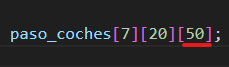

El programa no cae y nos devuelve un valor fuera de límites.

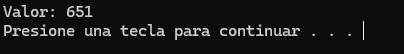

C++ confia en que el programador no se equivoque. 

Este error se puede solucionar con el apartado siguiente.

## Vectores<div id="id10"></div>
Muy parecido a los arrays.

Es una clase de la librería estándar de C++.

Crea estructuras contenedoras para almacenar datos de formas secuencial.

Pueden crecer o decrecer de tamaño de forma dinámica a diferencia de los arrays.

Proporcionan múltiples métodos para chequear límites, tamaño, comprobar si existe un elemento, etc.

Almacenan los valores en posiciones contiguas de la memoria y también en posiciones separadas accesibles a través de punteros.

### Declaración 
Declaración de dos vectores de diferente tipo.

```c++
#include <iostream>
#include <vector> //Necesario incluir la libreria vector
using namespace std; 

int main(){

    //Declaración del vector 
    vector <int> numeros;
    
    vector <char> letras;
}
```
Es imprescindible incluir la libreria vector.

También podemos asignar un tamaño al vector al declararlo. Pero no es necesario. Ya que el tamaño es dinámico. Se ajustará automáticamente.

```c++
#include <iostream>
#include <vector> //Necesario incluir la libreria vector
using namespace std; 

int main(){

    //Declaración del vector 
    vector <int> numeros(5); //5 datos de tipo entero
    
    vector <char> letras(7); //7 datos de tipo caracter 
}
```
De momento, al no haberle asignado valores al los vectores. El vector tipo int almacena 0 en todas sus posiciones. Y el tipo char almacena valores indeterminados.

### Acceso

Recorremos dos dos vectores con un bucle for.

```c++
#include <iostream>
#include <vector> 
using namespace std; 

int main(){

    //Declaración del vector 
    vector <int> numeros(5);

    vector <char> letras(7);

    //Recorrido de vectores
    for (int i=0; i<5;i++){
        cout << numeros[i] << endl;
    }
    for (int j=0; j<5;j++){
        cout << letras[j] << endl;
    }
}
```
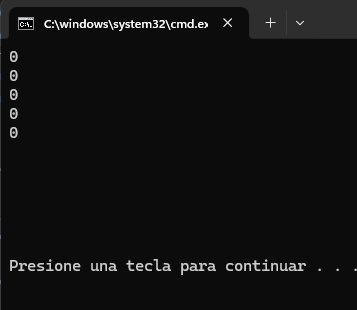

Da como resultado 5 ceros y 7 carácteres indeterminados.

### Declarar e inicializar 

```c++
vector <int> numeros{1,2,3,4,5,6};
vector <char> letras{'a','b','c','d'};
``` 
Los carácteres van entre comillas simples.

### Declarar e inicializar con el mismo valor

```c++
vector <double> salario_base(350, 1500.50);
```
Este vector tiene 350 posiciones, todas con el mismo valor.

### Bucle While
La mayoría de veces no sabemos cuantos elementos tiene un vector. Por su tamaño varible. 

Por lo que debemos utilizar un bucle while para recorrerlo. Ya que se trata de un bucle indeterminado.

```c++
#include <iostream>
#include <vector> 
using namespace std; 

int main(){

    vector <double> salario_base(11, 1500.50);

    int i=0;

    while (i<salario_base.size()){   //Método de la libreria vector para tomar el tamaño

        cout << salario_base[i] << endl;

        i++; // Al terminar la lectura incrementar el valor de i
    }
}
```
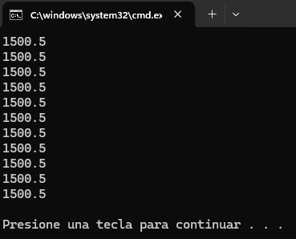

### Escritura de valores 

Utilizaremos dos métodos:
* at()
* push_back()

Estos métodos estan pensados para trabajr con los vectores dinámicamente (ya que cambian de tamaño).

Si accedemos a una posición fuera de límites obtendremos un valor indeterminado.

Como en el siguiente ejemplo accediendo a la posición **700**.

```c++
#include <iostream>
#include <vector> 
using namespace std; 

int main(){

    vector <int> numeros{1,2,3,4,5};
    
    cout << numeros[3] << endl;
    cout << numeros[700] << endl;
}
```
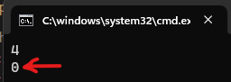

### Método at()
Nos devuelve un valor del vector y además **comprueba si la posición se encuentra entre los límites del vector**.
```c++
#include <iostream>
#include <vector> 
using namespace std; 

int main(){

    vector <int> numeros{1,2,3,4,5};
    
    cout << numeros.at(3) << endl;
    cout << numeros.at(700) << endl;
}
```
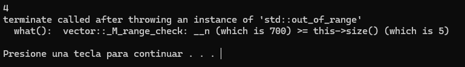
En este caso. La posición si se encuentra entre los límites y se imprime el valor. 

Pero la posición 700 no se encuentra entre los límites. Por lo que el programa lanza una **excepión**.

Además el método at() se utiliza para escribir un valor.

```c++
#include <iostream>
#include <vector> 
using namespace std; 

int main(){

    vector <int> numeros{1,2,3,4,5};  //Declaración e inicialización
    
    numeros.at(3)=40;  //Sobreescritura

    cout << numeros.at(3) << endl; //Lectura
}
```
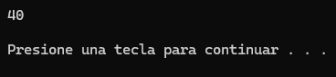

También me lanzará una excepción si intento escribir en una posición fuera de límites.

```c++
numeros.at(3)=40;
```
### Método push_back()
Almacena un valor mas e incrementa en uno el tamaño del vector.
```c++
#include <iostream>
#include <vector> 
using namespace std; 

int main(){

    vector <int> numeros{1,2,3,4,5};  

    numeros.push_back(80);

    int i =0;

    while (i<numeros.size())
    {
        cout << numeros.at(i) << endl;
        i++;
    }
}
```
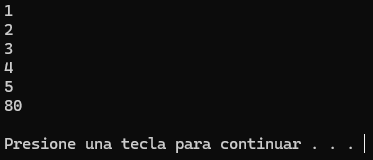

## Operadores<div id="id11"></div>

### Asignación
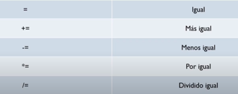

El operador += se utiliza para sumar dos variables sin ser necesario declarar una tercera variable para alojar el resultado de la operación.

```c++
#include <iostream>
using namespace std; 

int main (){
    int a = 1;
    int b = 2;

    b+=a; //Operador +=

    cout << b;
}
```
El mismo funcionamiento para los demás operadores.

### Aritméticos 
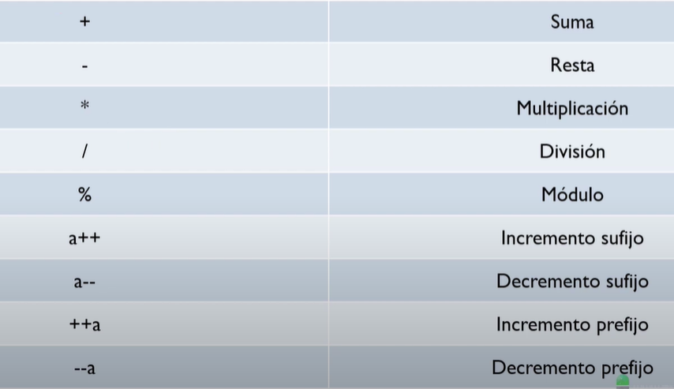
* **%** Módulo o residio. Resto de una divión.
* **a++** Incrementa en uno el valor
* **a--** Disminuye en uno el valor
* **++a** Incrementa en uno el valor
* **--a** Disminuye en uno el valor

Aunque realizan la misma función, se diferencian en el **momento en el que asignan el valor**.

#### Preincremento 
```c++
#include <iostream>
using namespace std; 

int main (){

    int a = 1;
    int b=++a;

    cout <<"a = "<< a << endl;
    cout <<"b = "<< b << endl;
}
```
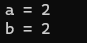

Primero se incrementa el valor de la variable A.
Posteriormente se asigna el valor de la variable A a B.

A la variable b se le asigna el valor ya incrementado de a.

#### Postincremento
```c++
#include <iostream>
using namespace std; 

int main (){

    int a = 1;
    int b=a++;

    cout <<"a = "<< a << endl;
    cout <<"b = "<< b << endl;
}
```
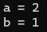

Primero es asignado el valor de A en B, y posteriormente se incrementrá el valor de la variable A.

Mismo funcionamiento para los decrementos.

### Conversiones de tipos 
Al realizar una operación entre variables de diferente tipo, en la variable resultado se realiza una conversión del tipo.
Conversiones implícitas.


> **El tipo de dato del resultado será el tipo de dato más amplio.**

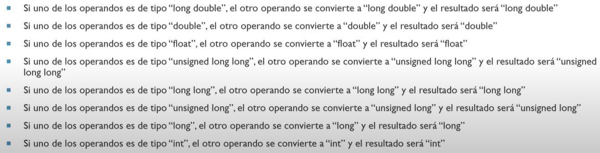

```c++
#include <iostream>
using namespace std; 

int main (){

    int a = 3;
    float b= 2.5f;
    double c = 8.0;

    auto resultado = b+c; //con auto se le asigna el tipo que mejor se le ajuste automáticamente a la variable 

    cout << typeid(resultado).name(); //devuelve la primera letra del tipo de la variable
}
```
En este caso, imprime una f.

Por ejempo. Vamos a realizar la media aritmética de 3 valores.

```c++
#include <iostream>
using namespace std; 

int main (){
    // todas las variables enteras
    int a = 10;
    int  b= 12;
    int  c = 30;

    auto resultado = (a+b+c)/3; 

    cout << resultado << endl << typeid(resultado).name(); 
}
```
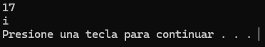

En este caso nos devuelve como resultado un entero. Por lo que esta operación es incorrecta. Ya que el resultado real de la media es un número decimal.

```c++
#include <iostream>
using namespace std; 

int main (){

    int a = 10; //entero
    int  b= 12; //entero
    float  c = 30; //decimal 

    auto resultado = (a+b+c)/3; 

    cout << resultado << endl << typeid(resultado).name(); 
}
```


## <div id="id12"></div>
## <div id="id13"></div>
## <div id="id14"></div>
## <div id="id15"></div>
## <div id="id16"></div>
## <div id="id17"></div>
## <div id="id18"></div>
## <div id="id19"></div>
## <div id="id20"></div>


