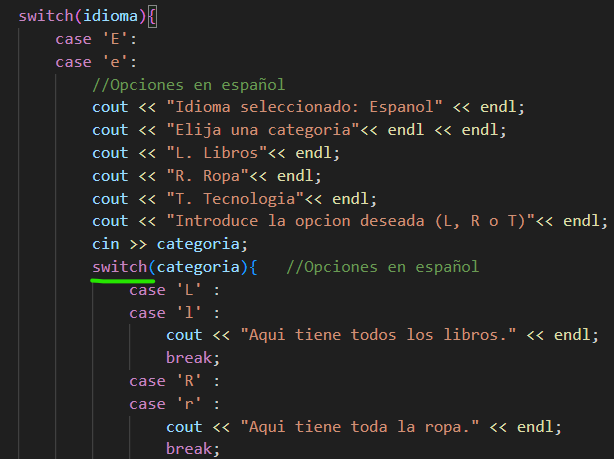
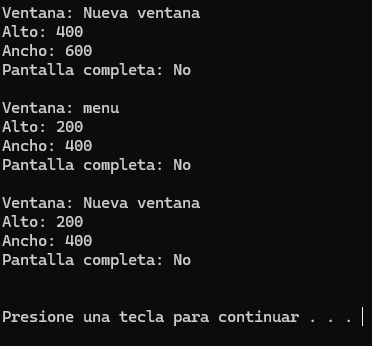

# Manual personal de C++
## Índice 

1. [Instalación](#id1)
2. [Primer progrma](#id2)
3. [Elementos de un programa](#id3)
4. [Tipos de datos y varibles](#id4)
5. [Introducir dato desde la terminal](#id5)
6. [Constante](#id6)
7. [Array](#id7)
8. [Array bidimensional](#id8)
9. [Arrays multidimensionales](#id9)
10. [Vectores](#id10)
11. [Operadores](#id11)
12. [Convenciones](#id12)
13. [Condicional If](#id13)
14. [Bucles](#id14)
15. [Bucle For](#id15)
16. [Bucle For-Each](#id16)
17. [Bucle While](#id17)
18. [Bucle Do-Wile](#id18)
19. [Intruccione break](#id19)
20. [Intruccion continue ](#id20)
21. [Bucles infinitos](#id21)
22. [Bucles anidados](#id22)
23. [Generar números aleatorios](#id23)
24. [Funciones](#id24)
25. [Paso de parámetros por valor y referencia](#id25)
26. [Sobrecarga de funciones](#id26)
27. [Funciones inline](#id27)
28. [Auto-return](#id28)
29. [Funciones recursivas](#id29)
30. [Punteros](#id30)
31. [Ubicación de la memoria dinámica con punteros](#id31)
32. [Array con punteros. Aritmética de punteros](#id32)
33. [Constantes y punteros](#id33)
34. [Paso de parámetros por referencia con punteros](#id34)
35. [](#id35)
36. [](#id36)
37. [](#id37)
38. [](#id38)
39. [](#id39)
40. [](#id40)

## Instalación <div id="id1"></div>
Necesitamos instalar la extension de C/C++ de VScode

Si utilizamos windows necesitamos instalar el compilador.

Comprobar si tenemos instalado el compilador y que versión.

El compilador que tenemos que instlar es: **MinGW-w64**
Nos dirigimos a la página oficial. 
[https://www.mingw-w64.org/](https://www.mingw-w64.org/) 
Descargas. 

Tenemos que instalr el programa MSYS2.

Seleccionamos la opción: MSYS2
Descargamos el instalador y lo ejecutamos.

Se nos acaba de instalar un entorno unix junto con el compilador gcc
En la terminal que acabamos de instalar. 

Vamos a instalar el compilador gcc.
copiando el siguiente comando:

`
pacman -S mingw-w64-ucrt-x86_64-gcc
`

Ya lo tendriamos instalado.


Acontinuación tenemos que actualizar los paquetes. 
Cerramos esta terminal y abrimos la terminal MSYS2 MSYS buscandola en el menu de windows.

Introducimos el comando: 

`
pacman -Suy
`

Seguido del comando: 

`
pacman -S --needed base-devel mingw-w64-x86_64-toolchain
`

Nos da la opctión de seleccionar que queremos instalar. 
En nuestro caso vamos a seleccionar todos introduciendo enter.


Ya hemos terminado de instalr todo.

Cerramos la terminal y la volvemos a abrir.

Comprobamos la versión instalada.


Esto no significa que no esté instalado. Si no que no está añadido al path. Es decir, no sabe donde está este programa. 

Nos dirijimos en el explorador de archivos a: Este esquipo / Windows (C:) / msys64  / mingw64 / bin 

Aqui se encuentra g++

Copiamos esta ruta: C:\msys64\mingw64\bin

En el buscador de windows ponemos: path

Abrimos: Editar las varibles de entorno del sistema

Opciones avanzadas -> varibles de entorno

En path editamos


Pulsamos en nuevo

Pegamos la ruta anterior y aceptar. 

Al comprobar de nuevo la versión.

Con esto ya hemos finalizado completamente la instalación del compilador gcc.


## Primer progrma <div id="id2"></div>

Escribimos un Hola mundo.


Pulsamos F1 y escribimos: integrated terminal 


Nos dirigimos a la dirección donde se encuentra nuestro archivo .cpp en la terminal y escribimos:

`
c++ nombre_del_archivo.cpp -o hola_mundo.exe
`

-o significa asignarle una salida.


Acontinuación ejecutamos el ejecutable que se nos ha creado. Introduciendo: 

`
/hola_mundo.exe
`


De esta forma hemos creado, compilado y ejecutado nuestro primer progrma.

### Extensión code runner 

Vamos a instalar una extensión a Visual Studio Code para compilar y ejecutar directamente nuestro código apretando un botón.


Apretando este boton el ejecuta las órdenes de la terminal por nosotros.


## Elementos de un progrma <div id="id3"></div>

```C++
#include <iostream>
using namespace std;

int main()
{
    cout << "Hola mundo" << endl;
    return 0;
}
```

```C++
#include <iostream>
```
Biblioteca

Incluye todo un conjunto de clases y funciones que pueden ser llamadas en el programa. Entre ellas la función count.

```C++
unsing namespace std;
```
Sentencias o declaraciones.
Indica que vamos a utilizar el espacio de nombres std.

En este caso la biblioteca std contiene a la función iostream

**Espacios de nombres**
Conjunto de funciones que contienen una biblioteca.
Sirve para evitar los conflictos de nombres.

```C++
int main()
```
Funcion principal. 
Secuencia de instrucciones que se ejecutan de arriba a abajo.

>Todo progrma empieza a ejecutarse en la primera línea de la función main.
Y termina con la última línea que contienen las llaves de la función main.

```C++
cout << "Hola mundo" << endl;
``` 
Character out. Sacar por consola un mensaje.
**endl** Es un salto de línea.

```C++
return 0;
```
Las funciones siempre nos devuelven un valor. Excepto las funciones del tipo void.

## Tipos de datos y variables <div id="id4"></div>

### Caracteres


Carácteres o enteros pequeños.

Enteros con signo del -128 al 127.

Enteros sin signo del 0 al 255.

### Enteros


Pueden ser sin signo. En este caso el valor se duplica.

### Decimales


Por ejemplo en un floal son: 38 decimales a la derecha y 38 decimales a la izquierda.

### Booleanos

Se puede sustituir por 0 o 1.

### Variable

Espacio en la memoria donde se almacena un valor que puede variar.

Se almacena en la memoria RAM. 
Al apagar el ordenador se borra.

>C++ Es un lenguaje fuertemente tipado.

Es necesario especificar de que tipo es esa variable.

Las variables siempre se deben declarar antes de utilizarlas.

### Eemplo

Para declarar una variable. 2 opciones.


Primero declarar la varible.

Lego inicializarla (Asignarle un valor).

Útil si en el momento de declararla todavía no tenemos claro que valor le vamos a asignar.


O declararla e inicializarla a la vez.


En este ejemplo se ve como el flujo del progrma va de arriba a abajo.

**C++ es case sensitive.**

Es decir, la variable **C**asa y **c**asa, son dos varibles diferentes. Afectan las mayusculas y minúsculas al nombre de la variable. 

## Introducir dato desde la terminal <div id="id5"></div>
El usuario da un valor a una variable a través de la consola.

```c
cin >> salario;
```


primero declaramos la varibale entero salario, Sin darle un valor (inicializarla).

Porsteriormente asignamos el valor a través de la la función **cin**, escribiendo el valor en la consola y pulsando enter.

## Constante<div id="id6"></div>
Una constante almacena un valor que **no puede cambiar.**

Se deben declarar e inicializar al mismo tiempo.

Tipos de constantes:

### Literales

**Expresiones o secuencias de escape**

**/n** Salto de línea

**/t** Tabulación

**/b** Espacio horizontal

### Declaradas
Dispone de la palabra reservada const
```C++
Const double iva = 0.21;
```
### Expresiones constanstes 

### Constantes enumeradas

### Definidas
Uso obsoleto.

```c++
#define double iva = 0.21;
```


## Array<div id="id7"></div>
Estructura que contienen varios valores del mismo tipo.

Almacena valores que tienen algo en común.

Una vez declaramos el array, no podemos modificar el número de elementos que contiene. Pero si el valor de cada uno de ellos.

### Declaración e inicialización

Varias formas:


```c++
int mi_array [5]{15,25,8,-7,92};
```

Array de enteros, de longitud 5 y con estos valores: **15 25 8 -7 92**

```c++
int mi_array [5]{15,25};
```

Array de enteros, de longitud 5 y con estos valores: **15 25 0 0 0**

```c++
float mi_array [5]{2.5};
```

Array de floats, de longitud 5 y con todos los valores iguales: **2.5 2.5 2.5 2.5 2.5**

```c++
int mi_array []{2,7,8,7,5,1};
```
No indicamos la longitud del array. Esta es tomada de la cantidad de valores introducidos.

Array de enteros, de **longitud 6** y con estos valores: **2 7 8 7 5 1**

### Declaración e inicialización por separado

El array empieza en la posición 0.


```c++
// Declaración
int mi_array [5];

//Almacenamiento
mi_array[0]=15;
mi_array[1]=28;
mi_array[2]=8;
mi_array[3]=-7;
mi_array[4]=92;
```

Para acceder al los valores de las diferentes posiciones:

```c++
//Acceso
mi_array[0];
mi_array[1];
mi_array[2];
mi_array[3];
mi_array[4];
```

### Sobrescritura
Modificación del valor de un elemento del array. Siempre introduciendo un valor del mismo tipo que el array.

```c++
mi_array[4]=88;
```
## Array bidimensional<div id="id8"></div>

Array que en cada una de su posición se desdobla e incluye otro array.
Contiene dos índices.
#### Array mono dimensional

#### Array bidimensional


### Declaración e inicialización 

Dos formas.

```c++
int mi_array[4][5]={15,25,8,-7,92,77,12,11,7,44,56,59,43,78,12,43,95,12,87,33};
```
```c++
int mi_array[4][5]={
    {15,25,8,-7,92},
    {77,12,11,7,44},
    {56,59,43,78,12},
    {43,95,12,87,33}
    };
```
Multiplicamos los íncides para obtener el número de elementos que contiene ele array.
4 x 5 = 20.

### Almacenamiento individual 

```c++
//Almacenamiento
mi_array[0][0]=15;
mi_array[0][1]=25;
mi_array[0][2]=8;
mi_array[0][3]=-7;
mi_array[0][4]=92;
```
Previamente tenemos que declarar el array.

### Acceso

```c++
//Acceso
mi_array[0][0]
```

Normalmente, el array bidimensional se declara y su contenido es escrito mediante dos bucles for anidados. 
Uno recorre las filas y otro las columnas.

En el siguiente ejemplo. Introducimos un array por consola, para finalmente imprimirlo en pantalla.

```c++
#include <iostream>
using namespace std;

int main (){
    //Declaración del array bidimensional
    int array_bidimensional[3][3];

    cout << "Introduce cada valor" << endl ;

    //Dos bucles for anidados para introducir los valores por consola
    for (int fila=0; fila<3; fila++){
        for (int columna=0; columna<3; columna++){
            cin >> array_bidimensional[fila][columna];
        }

    }
    cout << "Array bidimensional introducido:" << endl ;

    //Dos bucles for anidados para imprimir los valores 
    for (int a=0; a<3; a++){
        for (int b=0; b<3; b++){
            cout<< array_bidimensional[a][b]<< " ";
        }
        cout<< endl;

    }
}
```


## Arrays multidimensionales<div id="id9"></div>

Arrays de multiples dimensiones.

Un ejemplo de su uso:

Registrar los coches que pasan por un punto en cada hora a lo largo de todo un año.

```c++
#include <iostream>
using namespace std;

int main(){

    //Declaración del array tridimensional
    int paso_coches[24][31][12]; // Hora, dia, mes

    //Almacenamiento de un valor 
    paso_coches[7][20][5]=500;

    //Acceso 
    cout << "Valor: "<<  paso_coches[7][20][5];
}
```

Mediante esta estructura de 3 bucles for anidados podemos completar todo el array de numeros aleatorios del 0 al 1000.

```c++
#include <iostream>
using namespace std;

int main(){

    //Declaración del array tridimensional
    int paso_coches[24][31][12]; // Hora, dia, mes

    //Almacenamiento de valores aleatorios para todo el array
    for (int i=0; i<24; i++){

        for (int j=0; j<31; j++){

            for (int z=0; z<31; z++){

                paso_coches[i][j][z]= rand ()%1000;
            }
        }
        
    }

    //Acceso 
    cout << "Valor: "<<  paso_coches[7][20][5];
}
```
Si por error accedemos a un valor fuera de los límites del array. Por ejemplo: 


El programa no cae y nos devuelve un valor fuera de límites.


C++ confia en que el programador no se equivoque. 

Este error se puede solucionar con el apartado siguiente.

## Vectores<div id="id10"></div>
Muy parecido a los arrays.

Es una clase de la librería estándar de C++.

Crea estructuras contenedoras para almacenar datos de formas secuencial.

Pueden crecer o decrecer de tamaño de forma dinámica a diferencia de los arrays.

Proporcionan múltiples métodos para chequear límites, tamaño, comprobar si existe un elemento, etc.

Almacenan los valores en posiciones contiguas de la memoria y también en posiciones separadas accesibles a través de punteros.

### Declaración 
Declaración de dos vectores de diferente tipo.

```c++
#include <iostream>
#include <vector> //Necesario incluir la libreria vector
using namespace std; 

int main(){

    //Declaración del vector 
    vector <int> numeros;
    
    vector <char> letras;
}
```
Es imprescindible incluir la libreria vector.

También podemos asignar un tamaño al vector al declararlo. Pero no es necesario. Ya que el tamaño es dinámico. Se ajustará automáticamente.

```c++
#include <iostream>
#include <vector> //Necesario incluir la libreria vector
using namespace std; 

int main(){

    //Declaración del vector 
    vector <int> numeros(5); //5 datos de tipo entero
    
    vector <char> letras(7); //7 datos de tipo caracter 
}
```
De momento, al no haberle asignado valores al los vectores. El vector tipo int almacena 0 en todas sus posiciones. Y el tipo char almacena valores indeterminados.

### Acceso

Recorremos dos dos vectores con un bucle for.

```c++
#include <iostream>
#include <vector> 
using namespace std; 

int main(){

    //Declaración del vector 
    vector <int> numeros(5);

    vector <char> letras(7);

    //Recorrido de vectores
    for (int i=0; i<5;i++){
        cout << numeros[i] << endl;
    }
    for (int j=0; j<5;j++){
        cout << letras[j] << endl;
    }
}
```


Da como resultado 5 ceros y 7 carácteres indeterminados.

### Declarar e inicializar 

```c++
vector <int> numeros{1,2,3,4,5,6};
vector <char> letras{'a','b','c','d'};
``` 
Los carácteres van entre comillas simples.

### Declarar e inicializar con el mismo valor

```c++
vector <double> salario_base(350, 1500.50);
```
Este vector tiene 350 posiciones, todas con el mismo valor.

### Bucle While
La mayoría de veces no sabemos cuantos elementos tiene un vector. Por su tamaño varible. 

Por lo que debemos utilizar un bucle while para recorrerlo. Ya que se trata de un bucle indeterminado.

```c++
#include <iostream>
#include <vector> 
using namespace std; 

int main(){

    vector <double> salario_base(11, 1500.50);

    int i=0;

    while (i<salario_base.size()){   //Método de la libreria vector para tomar el tamaño

        cout << salario_base[i] << endl;

        i++; // Al terminar la lectura incrementar el valor de i
    }
}
```


### Escritura de valores 

Utilizaremos dos métodos:
* at()
* push_back()

Estos métodos estan pensados para trabajr con los vectores dinámicamente (ya que cambian de tamaño).

Si accedemos a una posición fuera de límites obtendremos un valor indeterminado.

Como en el siguiente ejemplo accediendo a la posición **700**.

```c++
#include <iostream>
#include <vector> 
using namespace std; 

int main(){

    vector <int> numeros{1,2,3,4,5};
    
    cout << numeros[3] << endl;
    cout << numeros[700] << endl;
}
```


### Método at()
Nos devuelve un valor del vector y además **comprueba si la posición se encuentra entre los límites del vector**.
```c++
#include <iostream>
#include <vector> 
using namespace std; 

int main(){

    vector <int> numeros{1,2,3,4,5};
    
    cout << numeros.at(3) << endl;
    cout << numeros.at(700) << endl;
}
```

En este caso. La posición si se encuentra entre los límites y se imprime el valor. 

Pero la posición 700 no se encuentra entre los límites. Por lo que el programa lanza una **excepión**.

Además el método at() se utiliza para escribir un valor.

```c++
#include <iostream>
#include <vector> 
using namespace std; 

int main(){

    vector <int> numeros{1,2,3,4,5};  //Declaración e inicialización
    
    numeros.at(3)=40;  //Sobreescritura

    cout << numeros.at(3) << endl; //Lectura
}
```


También me lanzará una excepción si intento escribir en una posición fuera de límites.

```c++
numeros.at(3)=40;
```
### Método push_back()
Almacena un valor mas e incrementa en uno el tamaño del vector.
```c++
#include <iostream>
#include <vector> 
using namespace std; 

int main(){

    vector <int> numeros{1,2,3,4,5};  

    numeros.push_back(80);

    int i =0;

    while (i<numeros.size())
    {
        cout << numeros.at(i) << endl;
        i++;
    }
}
```


## Operadores<div id="id11"></div>

### Asignación


El operador += se utiliza para sumar dos variables sin ser necesario declarar una tercera variable para alojar el resultado de la operación.

```c++
#include <iostream>
using namespace std; 

int main (){
    int a = 1;
    int b = 2;

    b+=a; //Operador +=

    cout << b;
}
```
El mismo funcionamiento para los demás operadores.

### Aritméticos 

* **%** Módulo o residio. Resto de una divión.
* **a++** Incrementa en uno el valor
* **a--** Disminuye en uno el valor
* **++a** Incrementa en uno el valor
* **--a** Disminuye en uno el valor

Aunque realizan la misma función, se diferencian en el **momento en el que asignan el valor**.

#### Preincremento 
```c++
#include <iostream>
using namespace std; 

int main (){

    int a = 1;
    int b=++a;

    cout <<"a = "<< a << endl;
    cout <<"b = "<< b << endl;
}
```


Primero se incrementa el valor de la variable A.
Posteriormente se asigna el valor de la variable A a B.

A la variable b se le asigna el valor ya incrementado de a.

#### Postincremento
```c++
#include <iostream>
using namespace std; 

int main (){

    int a = 1;
    int b=a++;

    cout <<"a = "<< a << endl;
    cout <<"b = "<< b << endl;
}
```


Primero es asignado el valor de A en B, y posteriormente se incrementrá el valor de la variable A.

Mismo funcionamiento para los decrementos.

### Conversiones de tipos 
Al realizar una operación entre variables de diferente tipo, en la variable resultado se realiza una conversión del tipo.
Conversiones implícitas.


> **El tipo de dato del resultado será el tipo de dato más amplio.**


```c++
#include <iostream>
using namespace std; 

int main (){

    int a = 3;
    float b= 2.5f;
    double c = 8.0;

    auto resultado = b+c; //con auto se le asigna el tipo que mejor se le ajuste automáticamente a la variable 

    cout << typeid(resultado).name(); //devuelve la primera letra del tipo de la variable
}
```
En este caso, imprime una f.

Por ejempo. Vamos a realizar la media aritmética de 3 valores.

```c++
#include <iostream>
using namespace std; 

int main (){
    // todas las variables enteras
    int a = 10;
    int  b= 12;
    int  c = 30;

    auto resultado = (a+b+c)/3; 

    cout << resultado << endl << typeid(resultado).name(); 
}
```


En este caso nos devuelve como resultado un entero. Por lo que esta operación es incorrecta. Ya que el resultado real de la media es un número decimal.

```c++
#include <iostream>
using namespace std; 

int main (){

    int a = 10; //entero
    int  b= 12; //entero
    float  c = 30; //decimal 

    auto resultado = (a+b+c)/3; 

    cout << resultado << endl << typeid(resultado).name(); 
}
```


Este resultado si es el correcto. Ya que la variable resultado **toma el tipo de variable mas preciso.** En este caso float.

### Comparación


Sobretodo se utilizan para el control de condicionales y bucles.

### Operadores lógicos


Se pueden concatenar comparaciones.

```c++
if (calificacion > 8 || (distancia>28 && ingreso < 2000) ){

}
```
En este caso, para que se ejecute el código del if, calificación debe de ser superior a 8, o que se cumplan las otras dos condiciones a la vez.

## Convenciones <div id="id12"></div>
Recomendaciones para nombrar diferentes elementos en C++.


## Condicional If <div id="id13"></div>
```c++
if(){

}
```
```c++
if(){

}
else{

}
```
## Condicional switch-case
Útil para cuando tenemos que evaluar muchas condiciones a la vez.

Podríamos llegar al mismo resultando concatenando muchos if else. Pero esta opción es mucho más cómoda.

```c++
switch (variable){
    case valor1:
        //Bloque de código para este caso
        break;

    case valor2:
        //Bloque de código para este caso
        break;
    default:
        //Bloque de código para cuando no se cumpla ninguna de los casos anteriores
}
```
**No es posible utilizar switch-case para comparar floats o strings.**

Utilizar switch-case para que el usuario elija el funcionamiento de un progrma.

```c++
#include <iostream>
using namespace std; 

int main (){

    int opcion;

    cout << "MENU"<< endl << endl;
    cout << "1. Mostrar mensaje"<< endl;
    cout << "2. Calcular la suma"<< endl;
    cout << "3. Salir del progrma"<< endl;
    cout << "4. Introduce la opcion deseada (1 , 2 o 3)"<< endl;
    cin >> opcion;

    switch(opcion){
        case 1:
            cout << "Realizar mostrar mensaje" << endl;   
            break;
        
        case 2:
            cout << "Realizar calcular la suma" << endl;   
            break;
        
        case 3:
            cout << "Realizar salir del progrma" << endl;   
            break;

        default:
            cout << "numero introducido incorrecto" << endl;   
    }
}
```


Para un mismo case podemos poner varias condiciones. 


Las siguientes líneas de código se ejecutarán siempre que la variable idioma sea 'e' o 'E'.

Esto puede ser útil en menús para evitar un error al no hacer distinción entre mayúscula y minuscula.

Es posible anidar un switch dentro de otro.



El Switch principal evalua idioma. Y el switch anidado evalua categoría.

### Operador ternario o condicional
Función idéntica a la de la estructura If-Else.

Es recomendable utilizarlo cuando las condiciones son sencillas. Ya que ahorra líneas de código.


Entre paréntesis la condición a evaluar, seguido de un signo de interrogación. 
A continuación, la acción a ejecutar cuando sea verdadero, dos puntos, la acción para cuando sea falso.

Ejemplo. Discriminar si un número es par o impar.

```C++
#include <iostream>
using namespace std; 

int main (){

    int numero;
    cout << "Introduce un mumero" <<endl;
    cin >> numero;
    /*     SENTENCIA IF-ELSE EQUIVALENTE
    if (numero%2 == 0){
        cout << "numero PAR";
    }
    else{
        cout << "numero IMPAR";
    }
    */
   cout << "Numero " << ((numero%2==0)?"PAR":"INPAR");
}
```
En este caso, al incluir el operador condicional en un cout, este ha de ir entre paréntesis. Devido al órden de preferencia de operadores.


## Bucles<div id="id13"></div>
2 tipos. 
* **Determinados**

Antes de ejecutar un progrma, sabemos la cantidad de veces que va a ejecutar el código en su interior.

Suele ser el bucle for.
* **Indeterminados**

No podemos saber la cantidad de veces que va a ejecutar el código en su interior.

Suele ser los bucles while y do-while.
```c++
while (condicion){
    //código
}
```
## Bucle For<div id="id14"></div>
for (Inicialización ; Condición ; Incremento){Cuerpo 
}
```c++
for (int i=0; i<5; i++){
    //código
}
```
Este bucle se ejecuta 5 veces. i=0, i=1, i=2, i=3 e i=4.

## Bucle For-Each<div id="id15"></div>

Utilizado para recorrer colecciones, como los arrays o los contenedores (vector,list,set,map,etc).

**Por cada** elemento de una colección ejecuta un código.

Es ideal para **recorrer contenedores dinámicos**. Crecen o decrecen.

```c++
#include <iostream>
using namespace std; 

int main(){
    int edades[]{25,24,72,2,0};
    
    for(int i:edades){
        cout << i << endl;
    }
}
```


La colección puede crecer todo lo que quiera, que el bucle For-Each le recorrerá de principio a fin.

La limitación es que solo podemos recorrer el array si la variable i del bucle la declaramos con el mismo tipo que el tipo del array.

### Inferencia de tipos
Característica de C++. Permite detectar el tipo de dato de una colección y ajustar el bulcle For-Each a este.

```c++
#include <iostream>
using namespace std; 

int main(){
    int edades[]{25,24,72,2,0};

    for(auto i:edades){  //definimos i como auto
        cout << i << endl;
    }
}
```
Obtenemos el mismo resultado que en el ejemplo anterior. 

Podemos recorrer un string para encontrar si contiene @ un correo electrónico.
```c++
#include <iostream>
using namespace std; 

int main(){
    string email="pedro@gmail.com";

    for(auto i:email){
        cout << ((i=='@')?"Hay @":"no hay") << endl;
    }
}
```


Ejemplo. **Combinación de bucle while y for-each.**
Vamos a introducir por consola los números que el usuario quiera en un vector y luego le vamos a recorrer.

```c++
#include <iostream>
#include <vector>
using namespace std; 

int main(){
    vector <int> numeros;  //Vector a recorrer
    int num; //numeros que vamos introduciendo

    cout << "Intoduce los numeros que quiera y para terminar intoroduce 0"<<endl;

    //Se ejecuta siempre que introduzcamos un número y este sea distinto de 0
    while (cin >> num && num!=0){ 
        //Vamos incrementando el vector con los números introducidos
        numeros.push_back(num);
    }
    
    cout << "Has introducido estos numeros:"<<endl;

    for(auto i:numeros){   //Recorremos el vector
        cout << i << endl;
    }
}
```


## Bucle While<div id="id16"></div>
Bucle indeterminado.
Repite el código un número indeterminado de veces, hasta que se produce una **condición de parada**.

while(condicion){cuerpo}

La condición en cualquier momento, mientras se está ejecutando el código puede cambiar de estado. True o False.

Podemos crear bucles infinitos.

Ejemplo. Indicar por consola si un número es par.

```c++
#include <iostream>
using namespace std; 

int main(){

    int numero{2};

    while (numero<10){  //Se esjecuta siempre que número sea menor que 10
        if (numero%2==0){
            cout << numero << " Es par"<<endl; 
        }
        
    }
}
```
Como la condición del bucle while siempre será verdadera. Entra el progrma en un bucle infinito.


Para solucionar esto. Por ejemplo, incrementamos el valor de num a cada vuelta de ejecución. 
Entoncess, se ejecutará el mensaje hasta que num llegue a 10.
Saliendo del bucle y terminado el programa.

```c++
#include <iostream>
using namespace std; 

int main(){

    int numero{2};

    while (numero<10){  //Se esjecuta siempre que número sea menor que 10
        if (numero%2==0){
            cout << numero << " Es par"<<endl; 
        }
        numero++; //Incremento a cada vuelta
    }
}
```


Ejemplo: Introducir una lista de numeros indetreminada y hacer la suma de estos.
```c++
#include <iostream>
#include <vector>;
using namespace std; 

int main(){
    vector <int> numeros;
    int num;
    int suma=0;

    cout << "Introduzca los numeros menores que 20. Para terminar introduzca 0."<<endl;
    cin >> num;

    //Cuando el num introducido valga 0 o sea mayor que 20 sale del bucle
    while(num!=0 && num<20){
        cout << "Numero introducido: "<< num <<endl;
        numeros.push_back(num); //Metemos el valor en el vector 
        suma=suma + num;  //Realizamos la suma hasta el momento

        cin >> num; //volvemos a preguntar por un nuevo número
        //De lo contrario, entraremos en un bucle infinito
    }

    cout << "Los numeros introducidos son:"<<endl;
    //Recorrer todo el vector para imprimir los valores
    for(auto i:numeros){
        cout << i << "  ";
    }

    cout << endl << "La suma es:"<<endl;
    cout <<suma;
}
```

## Bucle Do-Wile<div id="id17"></div>
Mismo funcionamiento que el bucle while. Además, si no se cumplen la condición. Se ejecuta una única vez en toda la ejecución del progrma.

**Nos asegura que se va a ejecutar al menos una vez.**

do {
    cuerpo

}

while(condición);

Por ejemplo. Un menú que disponga de dos opciones y una tercera de salida. Hasta que no selecionemos la salida no salimos del bucle. 

Incluso si introducimos algo diferente a la salida tampoco salimos.

```c++
#include <iostream>
using namespace std; 

int main(){
    int seleccion=0;

    do{
        cout <<"Seleccione una opcion.\n";
        cout <<"1. Opcion 1\n";
        cout <<"2 Opcion 2\n";
        cout <<"3. Salir\n";
        cin >> seleccion;
        if (seleccion==1) cout <<"OPCION 1\n";
        if (seleccion==2) cout <<"OPCION 2\n";
    }
    while (seleccion!=3);

    cout <<"Ha seleccionado salir\n";
    cout <<"Seguimos con el programa\n";
}
```


## Intrucción break<div id="id18"></div>
Al ejecurtarse, sale del bucle sin importar si la condición del bucle se sigue cumpliendo.

Sirve para optimizar el progrma. Ahorrar recursos del sistema.

Ejemplo. Vamos a recorrer un vector de nombres para en contrar uno en concreto.
```c++
#include <iostream>
#include <vector>
using namespace std; 

int main(){

vector<string>nombres{"Maria","Luisa","Juan","Pedro","Paco"};
string busqueda = "Luisa";

for (int i=0;i<nombres.size();i++){
    cout <<"Lectura de la posicion "<<i<<endl;

    if(nombres[i]==busqueda){
        cout << "Nombre: "<<nombres[i]<<"encontrado. En la posicion "<<i<<endl;
        //break;
    }
}

cout <<"Continua el progrma\n";
}
```

con el break comentado. Encuenta el nombre, pero sigue recorriendo el vector.

Incluyendo el break. Al encontrar el nombre, salimos del bubucle.

## Intrucción continue <div id="id19"></div>
Al ejecutarse, el bucle deja de ejecutar las acciones para el valor en el que se encuentra y salta al siguiente valor.

Ejemplo. Recorrer numeros del 1 al 5 saltandonos el número 3.
```c++
#include <iostream>
using namespace std; 

int main(){
    for(int i=0; i<6; i++){
        if(i==3){
            continue;
        }
        cout<< i <<endl;
    }
}
```


Otro ejemplo más práctico. En un vector con precios. Aplicar un descuento a los precios superiores a 100.
```c++
#include <iostream>
#include <vector>
using namespace std; 

vector<float>precios{50,60,200,100,40,300};
float descuento = 0.20; 
float precio_final;

int main(){
    cout << "Precios con descuentos \n\n";

    for(int i=0; i<precios.size(); i++){
        if(precios[i]<100){ //Siempre que el precio sea menor que 100 salimos de esta vuelta del bucle
            continue;
        }
    
        
        precio_final=precios[i]-(precios[i]*descuento);

        cout<< "El precio: " << precios[i]<<" se queda en: "<<precio_final<<endl;
    }
    cout << "Continua el programa";
}
```


## Bucles infinitos<div id="id20"></div>
En la mayoría de ocasiones se considera un error. El progrma queda atascado.

Hay escenarios en los que pueden ser necesario. Aplicaciones que deban ejecutarse constantemente. 

Por ejemplo un chat. Sistemas que quedan a la espera de que interactue el usuario con ellos.

Dos formas de realizar bucles infinitos.

```c++
for(;;){
}
```
```c++
while(true){
}
```
Por ejemplo. Reproducir la medida de un sensor cada 3 segundos en todo momento. Y que cuando supere la temperatura un valor determinado, mande una alerta.

Para ello es necesario utilizar algunas funciones de C++ que por el momento no conocemos.

```c++
#include <iostream>
#include <thread> //libreria hilos
#include <chrono> //libreria chrono
using namespace std;  

double leerTemperatura(){ //Funcion crear valores de temperatura 
    //Es double, porque el retorno es un valor double
    return 20.0 + (rand() % 20); //A 20 le sumo un número aleatorio entre 0 y 19.9999999(el 20 no está incluido en la experesión). 
    //Por lo que la lectura será de 20 a 40.
}

void esperarSegundos(int segundos){ //Funcion pausar el hilo de ejecucion
    this_thread::sleep_for(chrono::seconds(segundos));
}


int main(){
    const double limiteTemperatura = 35.0;

    for(;;){
        
        double temperaturaActual = leerTemperatura(); //Asignamos la temperatura de lectura a la función 
        cout << "Temperatura actual: "<<temperaturaActual<< " grados"<<endl;
        if(temperaturaActual>limiteTemperatura){
            cout << "ALERTA !!! Temperatura maxima alcanzada. "<<temperaturaActual<<" grados"<<endl;
        }
        esperarSegundos(3); //pausamos el hilo de ejecución 3s
    }
}
```


## Bucles anidados<div id="id21"></div>
Combinaciones multiples de bucles unos dentro de otros.

Casos de uso:

* Recorridos de arrays y vectores multidimensionales
* Generar combinaciones 
* Simulación de combinaciones
* Fuerza bruta
* Renderizado grágico
* Juegos 
* Ordenamiento
* Operaciones con cadenas
* Creación de entornos gráficos

Ejemplo. Imprimir en pantalla las tablas de multiplicar.

```c++
#include <iostream>
using namespace std;  
int main(){
    for(int i=0;i<11;i++){  //eje i
        for(int y=0;y<11;y++){ //eje y
        int resultado=i*y;
        cout << i <<" X "<<y<<"= "<<resultado<<endl;
        }
        cout << endl;
    }
}
```


Y continua hasta la del 10.

## Generar números aleatorios<div id="id22"></div>
Utilizamos anteriormente la experesión.
```c++
    int numero=rand() % 101;
```
Para en la variable número, se asignará valores aleatorios del 0 al 100, cada vez que se ejecute esta línea de código en un bucle.

Esto no es del todo cierto, ya que se creará un **patrón de números que siempre se repite**. Por lo que su funcionamiento no es del todo aleatorio.

Para solucionar esto, es fundamental el concepto semilla.

> **Semilla**
    o "seed" es un valor inicial utilizado para generar números aleatorios. Este valor inicial es importante porque determina la secuencia de números aleatorios que se generarán. Si usas la misma semilla cada vez que ejecutas un programa, obtendrás la misma secuencia de números aleatorios, lo que puede no ser deseado si necesitas resultados impredecibles.

La idea es **cambiar la semilla constantemente.**

```c++
#include <iostream>
#include <cstdlib> //métodos rand() y srand()
#include <ctime> //método time()
#include <thread> //libreria hilos
using namespace std;

int main(){
    
    while(true){
        srand(time(nullptr));
        int numero=rand() % 101;

        cout << numero <<endl;
        this_thread::sleep_for(chrono::seconds(2)); //Parar la ejecución del hilo 2 segundos
    }    
}
```


**srand()** -> Cambia la semilla

**time()** -> Time devuelve el tiempo actual desde la media noche del 01/01/1970.

Nos devuelve el tiempo que ha pasado desde entonces hasta la actualidad en segundos.

a la función time() le pasamos el argumento **nullptr**.

**nullptr nos devuelve el tiempo actual.**

Cada vez que se ejecute el progrma, la semilla será diferente, ya que el tiempo no es el mismo.

## Funciones<div id="id24"></div>
Bloque de código que se identifica con un nombre. Puede tener datos de entrada y devolver datos de salida.

Utilidades:
* Reutilización de código
* Dividir un programa en partes
* Abstracción 
* Reducción de errores

Tipos de funciones:
* Definidad por el promio lenguaje. 

    Incluidas en la biblioteca estandar de C++.

    https://en.cppreference.com/w/

* Definidad por el usuario.

    Creadas por el programador.

Por ejemplo. Si queremos utilizar la función pow. Tenemos que incluir esta librería.

```c++
#include <cmath> 
```
Ejemplo. Crear una función que eleve un número a la potencia.

Necesitamos incluir la libreria cmath. Para utilizar la función standar para elevar a la potencia. 

Además vamos a encapsular esta función en una función definida por el usuario.

```c++
#include <iostream>
#include <cmath> //Método pow (elevar a la potencia)
using namespace std;  

//DEFINICIÓN DE LA FUNCIÓN - Fuera de la función main

// función del tipo double porque su salida es double, definimos dos argumentos del tipo double como entrada
double elevar_potencia(double base, double exponente){ 
    return pow(base,exponente); 
    //la salida es el resultado de la operación
    }

int main(){

    //LLAMADA A LA FUNCIÓN, con los dos valores deseados de entrada
    cout << elevar_potencia(2,2);
}
```
El resultado es 4.

### Funciones prototipo

Si situamos la definición de la función después de hacer la llamada a la función en el main. Nos da un error.

No podemos llamar a una función que todavía no ha sido definida.

Para evitar este problema, utilizamos funciones prototipo.

Un prototipo es una declaración previa de la función. Informa al compilador que se utilizará esa función y sus características.

Esto es útil para progrmas muy grandes.

Es posible de crearlas en archivos externos. (.h / .hpp). Hace posible la podularización.

```c++
#include <iostream>
#include <cmath> 
using namespace std;  

double elevar_potencia(double base, double exponente); //Función prototipo

int main(){
    cout << elevar_potencia(2,2); //Llamada
}

//Declaración
double elevar_potencia(double base, double exponente){ 
    return pow(base,exponente); 
    }
```

> Cuando la función no me devuelve nada. Ha de ser del tipo void.

```c++
void elevar_potencia(double base, double exponente){
    cout << pow(base,exponente) <<endl;
}
```
## Paso de parámetros por valor y referencia <div id="id25"></div>
* **Por valor:** Pasos de parámetros a la fucnción como lo estamos haciendo hasta ahora. Al hacer la llamada a la función, esta **crea una copia exacta  de los valores** alojada en la función.

    Si los valores originales cambian después de la llamada a la función, en la función los nuevos valores no estarán actualizados.

Ejemplo. una función va a tomar el valor de un número y le va a agignar un nuevo valor 

```c++
#include <iostream>
#include <cmath> 
using namespace std;  

void funcion(int num_f){
    cout << "Valor: "<<num_f<<" "<<endl;
    cout << "Nuevo valor para numero: "<<endl;
    cin >> num_f;
}

int main(){
    int numero = 1;

    funcion(numero); //En num_f se guarda una copia de numero

    cout << "Valor al fina: "<<numero<<endl; //Se imprime número, no ha sido modificado, se ha modificado la copia
}
```


A pesar de haber introducido un valor, la variable original no se modifica.

Para solucionar esto utilizamos la siguiente propiedad.

* **Por referencia**

```c++
#include <iostream>
#include <cmath> 
using namespace std;  

void funcion(int &num_f){  //con &num_f se asocia a la función la dirección de memoria de la variable 
    cout << "Valor: "<<num_f<<" "<<endl;
    cout << "Nuevo valor para numero: "<<endl;
    cin >> num_f;
}

int main(){
    int numero = 1;

    funcion(numero); 

    cout << "Valor al fina: "<<numero<<endl; 
}
```


En este caso, la función si modifica el valor de numero, ya que esta accede directamente a la memoria en la que se aloja. No realiza una copia.

#### Utilidades:
* **por valor**
    * Operaciones que no requieren modificar el valor original.
    * Funciones que necesitan garantizar que el valor original no sea modificado.
* **por referencia**
    * Evitar copias costosas. Eficiencia del programa.
    * Devolución de multiples valores.
    * Polimorfismo.


## Parámetros por defecto<div id="id26"></div>

Al declar la función, asignamos un valor contreto a un parámetro.

Al hacer la llamada, pasarle este argumento es opcional. 

Si le pasamos otro valor como argumento, tomarará este valor y no el que le asignamos en su declaración.

Ejemolo. Función que imprime un mensaje una vez. Si se le pasa el argumento opcional, se imprimirá el mensaje varias veces.

```c++
#include <iostream>
#include <cmath> 
using namespace std;  

void mostrar_mensaje(string mensaje,int veces = 1){ //Veces queda definido con valor 1
    for(int i=0 ;i<veces; i++){
        cout << mensaje << endl;
    }
}


int main(){
    mostrar_mensaje("Hola");
}
```


Imprime el mensaje una vez.

```c++
#include <iostream>
#include <cmath> 
using namespace std;  

void mostrar_mensaje(string mensaje,int veces = 1){ //Veces queda definido con valor 1
    for(int i=0 ;i<veces; i++){
        cout << mensaje << endl;
    }
}


int main(){
    mostrar_mensaje("Hola",4); //Parámetro opcional con valor 4
}
```


Imprime las veces indicadas el mensaje.

> El parámetro por defecto siempre tiene que estar en último lugar.

> Podemos tener más de un parámetro por defecto.

Ejemplo. Función que me cree ventanas con las características especificadas. Ancho y alto; o pantalla completa; título.

```c++
#include <iostream>
#include <cmath> 
using namespace std;  

void crear_ventana(int alto = 400,int ancho = 600,string titulo = "Nueva ventana",bool completa = false){
    cout << "Ventana: "<<titulo<<endl
    <<"Alto: "<<alto<<endl
    <<"Ancho: "<<ancho<<endl
    <<"Pantalla completa: "<<(completa?"Si":"No")<<endl<<endl; //Operador ternario, abreviatura de if
}
    
int main(){
    crear_ventana();
    crear_ventana(200,400,"menu");
    crear_ventana(200,400);
}
```


Como podemos observar, tenemos infinitas opciones utilizando los parámetos por defecto.

## Sobrecarga de funciones<div id="id26"></div>
No es una característica únicamente de C++. Este concepto está en muchos lenguajes.

> Declarar varias funciones con el mismo nombre, pero con diferente lista de parámetros de entrada.

El tipo de dato de salida no influye.

Declarar varias funciones con la misma lista de parámetros da error.

Cuidado con utilizar parámetros predeterminados. Induce a errores.

### Utilidades
* Legibilidad del código
* Abstracción
* Flexibilidad 
* Polimorfismo

Ejemplo.

```c++
#include <iostream>
#include <cmath> 
using namespace std;  

int sumar(int a,int b){
    return a + b;
}
int sumar(int a, int b, int c){
    return a + b + c;
}
float sumar(float a, float b){
    return a + b;
}
    
int main(){
    cout << sumar(1,1) <<endl;
    cout << sumar(1,1,1) <<endl;
    cout << sumar(1.2f,1.2f) <<endl;
}
```


```c++
#include <iostream>
#include <cmath> 
using namespace std;  

//Funciones con valores por defecto

int mostrar(int a=1){
    cout << a <<endl;
}
int mostrar(int a=2){
    cout << a <<endl;
}
    
int main(){
    mostrar();    //Error, no sabemos a que función se refiere
}
```
Esto da error.

Otro caso.
```c++
#include <iostream>
#include <cmath> 
using namespace std;  

//Funciones con valores por defecto

int mostrar(int a=1){
    cout << a <<endl;
}
int mostrar(int b, int a=2){
    cout << a << b << endl;
}
    
int main(){
    mostrar();  //Se refiere a la primera función
}
```


## Funciones inline<div id="id27"></div>
Funciones cuyo cuerpo se va a situar en el mismo punto del código de la llamada.

Reduce el consumo de recuersos en la llamada. Útil para funciones pequeñas que se utilizan constantemente.
```c++
inline int sumar(int a, int b){
    return a+b;
}
```
**Ventajas**
* Optimización de rendimiento.
* Menor tiempo de ejecución.
* El compilador decide. Decide si esa función actuará como inline.

**Desventajas**
* Impacto en el tamaño del código. 
    
    No del código fuente. Del código resultante después de compilar.

## Auto-return<div id="id28"></div>

Deducción automática del tipo de función.

De la misma forma que cuando declaramos una variable con el tipo auto.

Característica introducida en el estandar C++14.

El compilador decide.

**Se utiliza cuando no sabamos exactamente que tipo de dato nos va a devolver la función.**

```c++
auto suma(int a,int b){
    return a+b;
}
```
En este caso la función tomará el tipo int.

**Casos de uso**
* Trabajo con tipos complejos.
* Trabajo con genéricos.
* Trabajo con tipos anidados progundos.
* Trabajo con funciones lambda.
* Trabajo con variables auto.
* Trabajo con tipos definidos por el programador.
* Trabajo con funciones de return condicionales.

```c++
#include <iostream>
using namespace std;  

//Plantilla genérica
template <typename T,typename U> //Utilización de genéricos
auto suma(T a,U b){ //Estas dos variables pueden ser de cualquier tipo
    return a+b;
}

int main(){
    //con dos enteros
    auto resultado1 = suma(5,3);
    //con entero y flotante
    auto resultado2 = suma(1,2.5);
    //con dos flotantes
    auto resultado3 = suma(1.5,1.2);

    cout << resultado1 <<" / "<<resultado2<<" / "<<resultado3<<endl;
}
```


En este caso, la primera función nos devuelve un entero, y la segunda y tercera un float.

Si por ejemplo. En vez de auto, a la función la pongo como tipo entero.


El progrma no cae. Porque al utilizar genéricos le podemos pasar cualquier tipo como argumento. Pero en los dos últimos casos nos vevuelve 2 enteros cuando nos tendría que devolver dos floats. 3.5 y 2.7 .

## Funciones recursivas<div id="id29"></div>
Funciones que se llaman a si mismas durante su ejecución.
```c++
int funcion(){
    funcion();
}
```
Su funcionamiento es parecido a un bucle infinito.

**Utilización**
* Recorrido de estructuras complejas.
* Algoritmos de búsqueda.
* Algoritmos de ordenamiento.
* Algoritmos matemáticos.

**Aspectos a tener en cuenta** 
* Disponer de caso base. Detiene la recursión.
* Disponer de un paso recursivo. La llamada a si misma.
* Consume mas recursos que un bucle infinito. 
* La legibilidad del codigo aumenta.

Ejemplo. Crear una función que calcule el factorial de un número.

Multiplicar un número por todos los que le preceden. 5!= 5 x 4 x 3 x 2 x 1

Sin utilizar recursividad:
```c++
#include <iostream>
using namespace std;  

auto factorial(int num){
    int memoria = num;
    auto resultado=1;

    for (int i=0;i<num;i++){
        memoria = memoria - 1;
        if(memoria==0)break;
        resultado=resultado*memoria; //A cada vuelta le multiplico el número
    }

    resultado=resultado*num; //Finalmente multiplico el resultado por el numero introducido

    return resultado;

}

int main(){
    int numero;
    cout <<"Introduce un numero: "<<endl;
    cin >> numero;
    cout <<endl;
    cout << "!"<<numero<<" es: "<<factorial(numero)<<endl;
}
```


La función la vamos a hacer recursiva.

```c++
#include <iostream>
using namespace std;  

auto factorial(int n){
    if (n==0){
        return 1; //Caso base
    }
    else{
        return n*factorial(n-1); //Recursividad
    }

}

int main(){
    int numero;
    cout <<"Introduce un numero: "<<endl;
    cin >> numero;
    cout <<endl;
    cout << "!"<<numero<<" es: "<<factorial(numero)<<endl;
}
````


Mismo resultado. Pero diferente funcionamiento.

```
En 1º vuelta: n=5 -> 5 * factorial[4]

En 2º vuelta: n=4 -> 4 * factorial[3]

En 3º vuelta: n=3 -> 3 * factorial[2]

En 4º vuelta: n=2 -> 2 * factorial[1]

En 5º vuelta: n=1 -> 1 * factorial[0] (Factorial de 0 es 1)

en 6º vuelta: n=0  Caso base. Salida del bucle.
```

A cada vuelta, la operación entra a la espera, porque se hace otra vez la llamada a la función. Hasta que se produce el caso base.

## Punteros<div id="id30"></div>

Es una característica fundamental de C++. Permiten una gestión eficiente y detallada de la memoria.
**Consisten en variables que guardan direcciones de memoria.**

**Utilidades**
* Acceso directo y modificación de memoria
* Funciones dinámicas y estructuras de datos.
* Paso de parámetros por referencia.
* Arrays y strings.
* Programación de bajo nivel.

**Ventajas de lenguajes que contien punteros**
* Control directo de la memoria.
* Flexibilidad en el manejo de datos.
* Interación con hardware a bajo nivel.
* Paso de parámetros por referencia.
* Compatibilidad con C.

**Ventajas de lenguajes que no contien punteros**
* Más simplicidad en el desarrollo.
* Mayor seguridad.
* Menor preocupación por fallos de memoria.

### Declarar puntero y almacenar direcciones en puntero

```c++
#include <iostream>
using namespace std;  

int main(){
    int variable = 10; //Declaración e inicialización de variable 

    int * puntero; //Declaración de puntero 
    puntero=&variable; //En el puntero guardamos la dirección de la variable

    cout << variable <<endl;

    cout << puntero <<endl;   ////Imprimir el puntero
    cout << &variable <<endl; //Imprimir dirección de memoria de la variable 
}
```


La variable está alojada en una dirección de memoria determinada.

Podemos observar que en el puntero se ha guardado la direción de memoria de la variable.

El puntero me permite acceder tanto a la rirección de memoria como al valor.

```c++
#include <iostream>
using namespace std;  

int main(){
    int variable = 10; //Declaración e inicialización de variable 

    int * puntero; //Declaración de puntero 
    puntero=&variable; //En el puntero guardamos la dirección de la variable

    cout << puntero <<endl;   ////Imprimir dirección de puntero
    cout << *puntero <<endl;   ////Imprimir valor de puntero
}
```


### Modificar una variable desde el puntero

```c++
#include <iostream>
using namespace std;  

int main(){
    int variable = 10; 

    int * puntero; 
    puntero=&variable; 

    * puntero=1;  //Modificar una variable desde el puntero
    cout << *puntero <<endl;   
}
```


Ejemplo. Puntero como parámetro de una función.
```c++
#include <iostream>
using namespace std;  

int variable = 10; 

void funcion(int * puntero){ //función como parámeto un puntero
    * puntero = 20;   //Cambiamos el valor a lo que apunta puntero
}

int main(){
    
    funcion(&variable); //Ejecutamos función con la dirección de la variable
    cout << variable;

}
```


Modifica el valor de la variable.

Estoy es muy útil cunado manejamos volúmenes grandes de información.

Porque al trabajar con punteros, no estamos realizando una copia. Si no que estamos trabajando diréctamente sobre la memoria.
Es muy eficiente.

## Ubicación de la memoria dinámica con punteros <div id="id31"></div>

Todos los progrmas, en cualquier lenguaje de programación. 
Su memoria RAM se divide en 4 partes.


Vamos a centrarnos en estas dos:

* **Stack**
    
    Gestión de llamadas a funciones, almacenamiento de variables locales, parámetros de las funciones, return de las funciones.

    Tiene un tamaño limitado. Tamaño determinado por el S.O.

    Si no progrmamos adecuadamente podemos sobrepasa la memoria. Stack overflow.

    Su funcionamiento es del tipo LIFO. Last in first out. El último en entrar es el primero en salir. Ya que los datos se almacenan en forma de pila.

    La gestión de esta memoria es automática. Se asocia con el flujo de ejecución de un programa.

    Al ejecutar una función, todo lo que conlleva la función se almacena en el stak. Una vez finalizada la ejecución de la función, esos datos se eliminan del stack.

* **Heap**

    Asignación dinámica de la memoria. Aplica a los punteros.
    
    **En C++ es gestionada por el programador.** Asignaciones y liberaciones de memoria.

    Su tamaño es mucho mas flexible que el stack. Se ajusta en función de las necesidades de ejecución del programa.

    Su gestión ineficiente puede dar lugar a problemas. Fragmentación de memoria, fuga de memoria (memory leak).

### Donde se almacena un puntero

#### Crear un espacio en el heap

Ejemplo. Vamos a declar un puntero y guardar lo que apunta en el heap.

```c++
#include <iostream>
using namespace std;  

int main(){
    
    int * puntero={nullptr}; //Declaramos el puntero y lo inicializamos como nulo
    // Si no, este puntero podría tomar cualquier valor que se encuentre en memoria 

    //Asignar espacio de la memoria en el heap. Con el operador new
    puntero = new int;  //Reserva un espacio en el heap para un entero

    //Imprimir la dirección en mememoria de lo que apunta el puntero (dirección en el heap)
    cout << puntero << endl;
    //Imprimir la dirección en mememoria del propio puntero (dirección en el stack)
    cout << &puntero << endl;
}
```


Es necesara la utilización del **operador new**. Ya que en C++, el heap es una memória dinámica, gestionada diréctamente por el programador.

#### Borrar espacio en el heap

Ejemplo. Delcarar un vector, asignarle un espacio en el heap, y luego borrarle.

```c++
#include <iostream>
using namespace std;  

int main(){
    
    int * puntero= new int; //Declarar un puntero y asignarle memoria en el heap

    * puntero = 10; //Asignar a la variable a la que apunta al puntero valor

    cout <<"Valor del puntero antes de delete: "<<*puntero<<endl;
    cout <<"Direcion de memoria: "<<puntero<<endl;

    delete puntero; //Borrar espacio de memoria del heap

    //Se convierte en un puntero colgante
    cout <<"Valor del puntero despues de delete: "<<*puntero<<endl;
    cout <<"Direcion de memoria: "<<puntero<<endl; //Se sigue almacenamdo la dirección de memoria que ha sido liberada
}
```

Se convierte en un puntero colgante al elminiar el heap.

Para solucionar esto.
```c++
#include <iostream>
using namespace std;  

int main(){
    
    int * puntero= new int; 

    * puntero = 10; 

    cout <<"Valor del puntero antes de delete: "<<*puntero<<endl;
    cout <<"Direcion de memoria: "<<puntero<<endl;

    delete puntero; 
    puntero = nullptr; //Asignamos la dirección del puntero a null

    cout <<"Valor del puntero despues de delete: "<<*puntero<<endl;
    cout <<"Direcion de memoria: "<<puntero<<endl; 
}
```

Asignamos una nueva dirección del puntero. A una direción no válida. Null.


Esto es una buena práctica.

## Array con punteros. Aritmética de punteros<div id="id32"></div>

Propiedades de los arrays relacionadas con los punteros en C++.

* Un array en C++, es un puntero al primer elemento del array.

* El nombre del arrary, Es la dirección de memoria del primer elemento del array.

* Cuando se usa el nombre del array sin ningún índice, se obtiene la dirección en memoria del primer elemento de array.

```c++
#include <iostream>
using namespace std;  

int main(){
    int cifras[]={10,20,30}; 
    
    cout << cifras << endl; // Dirección de memoria del primer elemento del array
    cout << *cifras << endl; // Valor del primer elemento del array
}
```

* Cuando un puntero apunta al mismo tipo de dato que los elementos de un array, en casi todos los escenarios puedes usar el nombre del puntero y el nombre del array de manera intercambiable para realizar operaciones similares.

    Especiamente en lo que respecta a la indexación y aritmética de punteros. Sin embargo, el "casi" indica que hay excepciones a esta regla.

```c++
#include <iostream>
using namespace std;  

int main(){
    int cifras[]={10,20,30}; 

    //Utilizando el nombre del array
    cout << cifras << endl; 
    cout << *cifras << endl; 

    //Utilizando el nobre del puntero del mismo tipo
    int * puntero{cifras};

    cout << puntero <<endl; 
    cout << *puntero <<endl; 
}
```


Vemos que obtenemos la misma dirección y valor de las dos maneras.

### Aritmética de punteros

Es un concepto de programación relevante en los lenguajes C y C++.

Permite realizar operaciones aritméticas sobre los punteros. 

Los punteros son variables que almacenan direcciones de memoria. 

La aritmética de punteros se utiliza para calcular direcciones de memoria, lo que permite acceder y manipular datos en diferentes posiciones de un array o bloque de memoria.

Esto es una funcionabilidad de muy bajo nivel. Ya que estamos trabajando diréctamente con la memória.

**Operaciones con punteros** 

* Incremento (++)

    Se aumenta su valor para que apunte al siguiente elemento del arreglo.
    
    El incremento se realiza en base al tamaño del tipo de dato al que apunta el entero.

    Por ejemplo. Si un puntero de tipo int (suponiendo que un entero tenga un tamaño de 4 bytes) apunta al inicio de un arreglo.

    Al incrementar el puntero, este apuntará 4 bytes adelante en memoria.

* Decremento (--)

    Similar al incrimento. Se decrementa su valor. 
* Suma (+)

    Sumar un entero a un puntero, para que este avance varios elementos en el arreglo.

    El vance se calcula: multiplicando el tamaño del tipo de dato por el número entero.
* Resta (-)

    Similar a la suma. 

Ejemplo. Asociamos un puntero al primer elemento del array. Realizamos aritmética de vectores.

```c++
#include <iostream>
using namespace std;  

int main(){
    int cifras[]={10,20,30,40}; 

    int * puntero = cifras; // Asociamos un puntero al primer elemento del array

    cout << "Antes de hacer el incremento "<< *(puntero)<<endl;
    puntero ++; //Incremento puntero
    cout << "Valor final "<< *(puntero)<<endl<<endl;

    cout << "Antes de hacer el incremento "<< *(puntero)<<endl;
    puntero ++; //Incremento puntero
    cout << "Valor final "<< *(puntero)<<endl<<endl;

    cout << "Antes de hacer el decremento "<< *(puntero)<<endl;
    puntero --; //Decremento puntero
    cout << "Valor final "<< *(puntero)<<endl<<endl;

    cout << "Antes de hacer el incremento de 2 posiciones "<< *(puntero)<<endl;
    cout << "Valor final "<< *(puntero + 2)<<endl<<endl; //Incremento 2 posiciones diréctamente en el cout

    cout << "Antes de hacer el decremento de 10 posiciones "<< *(puntero)<<endl;
    cout << "Valor final "<< *(puntero - 10)<<endl<<endl; //Decremento 10 posiciones diréctamente en el cout
}
```


En la última operación incrementamos por un valor fuera de los límites del array.
Provocamos un desbordamiento de array o out of bounds access. Produce un comportamiento indefinido.

## Constantes y punteros<div id="id33"></div>
Interacción de los punteros con las constantes. 

3 posibilidades:
* **Punteros a constantes:**

    Puntero que apunta a un valor constante. 
    
    No podemos incrementar el valor mediante el puntero.

    Si podemos hacer que el puntero apunte a otra dirección.

    ```c++
    #include <iostream>
    using namespace std;  

    int main(){
        // Puntero a constante
        const int constante1= 10; 
        const int constante2= 20; 

        const int *puntero1 = &constante1; 
        //Con la palabra reservava const indicamos que apunta a una constante, pero el puntero no es constante, podiría apuntar a otra constante.

        cout << *puntero1 <<endl;
        puntero1 = &constante2;
        cout << *puntero1 <<endl;
    }
    ```
    
    
    Cambiamos que el puntero apunte a otra variable.

* **Punteros constantes:**

    Puntero cuya dirección de memoria no puede cambiar después de su inicialización.

    Pero si puede cambiar el valor del emento al que apunta. 
    
    A menos que este también sea una cosntante.

    ```c++
    #include <iostream>
    using namespace std;  

    int main(){
        // Puntero constante 

        int variable = 10;

        int * const puntero = &variable; 
        // Con la 1º palabra reservada int, indicamos que apunta a un tipo entero
        // Con la 2º palabra reservada const despues del *, indicamos que el puntero es constante
        cout << *puntero << endl;
        
        *puntero = 20; //Modificamos la variable, el puntero es constante, cambiamos el valor de variable mediante el puntero

        cout << *puntero << endl;
    ```
    
    
    La dirección del puntero es constante. Pero el valor de la constante si cambia.

* **Punteros constantes a constantes:**

    Mezcla de las dos anteriores.

    Puntero que no puede cambiar su dirección despues de su inicialización y apunta a una constante.
    ```c++
        #include <iostream>
    using namespace std;  

    int main(){
        // Puntero constante que apunte a una constante

        const int constante = 10;

        const int * const puntero = &constante; 
        // Con la 1º palabra reservada const, apunta a una constante 
        // Con la 2º palabra reservada int, tipo de dato de la constante 
        // Con la 3º palabra reservada const, puntero constante
        cout << *puntero << endl;
    }
    ```
    

## Paso de punteros como parámetros<div id="id34"></div>

Características:
* **Modificación directa**
    
    Permite modificar la variable original sin necesidad de retornar un valor y asignarlo sin hacer copias.

* **Eficiencia en la transmisión de datos grandes**
    
    Al pasar solo la dirección de memoria de un objeto grande (como arrays o estructuras complejas), se ahorra tiempo y memoria porque no es necesario copiar todo el objeto.
    
* **Trabajo con arrays y cadenas**
    
   Los arrays se pasan por defecto como punteros a sus primeros elementos. Lo que hace que trabajar con ellos sea natural y eficiente.

* **Gestión de memoria dinámica**
    
    Facilita el trabajo con memoria dinámica (asignada con new o malloc), permitiendo que las funciones modifiquen estructuras de datos complejas o arrays dinámicos.

### Dierencias 
* **Pasar un parámetro por referencia**
    * No trabajas directamente con direcciones de memória en el códio.
    * Acceso directo al original, sin necesidad de desfragmentar.
    * La sintaxis y el maneo son generalmente más sencillos y seguros.
    * No permite trabajo a bajo nivel y trabajo con la memoria.
* **Pasar un puntero como parámetro**
    * Pasas dirección de memoria de variable.
    * Hay que desreferenciar el puntero para modificar el valor al que apunta.
    * Sintaxis más compleja.
    * Permite el trabajo a bajo nivel y el trabajo directo con la memoria.


## <div id="id35"></div>
## <div id="id36"></div>
## <div id="id37"></div>
## <div id="id38"></div>
## <div id="id39"></div>
## <div id="id40"></div>
