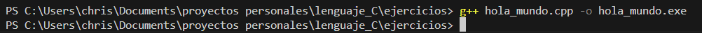

# Manual personal de C++
## Índice 

1. [Instalación](#id1)
2. [Primer progrma](#id2)
3. [Elementos de un programa](#id3)
4. [Tipos de datos y varibles](#id4)
5. [Introducir dato desde la terminal](#id5)
6. [](#id6)
7. [](#id7)
8. [](#id8)
9. [](#id9)
10. [](#id10)
11. [](#id11)
12. [](#id12)
13. [](#id13)
14. [](#id14)
15. [](#id15)
16. [](#id16)
17. [](#id17)
18. [](#id18)
19. [](#id19)
20. [](#id20)


## Instalación <div id="id1"></div>
Necesitamos instalar la extension de C/C++ de VScode

Si utilizamos windows necesitamos instalar el compilador.

Comprobar si tenemos instalado el compilador y que versión.

El compilador que tenemos que instlar es: **MinGW-w64**
Nos dirigimos a la página oficial. 
[https://www.mingw-w64.org/](https://www.mingw-w64.org/) 
Descargas. 

Tenemos que instalr el programa MSYS2.

Seleccionamos la opción: MSYS2
Descargamos el instalador y lo ejecutamos.

Se nos acaba de instalar un entorno unix junto con el compilador gcc
En la terminal que acabamos de instalar. 

Vamos a instalar el compilador gcc.
copiando el siguiente comando:

`
pacman -S mingw-w64-ucrt-x86_64-gcc
`

Ya lo tendriamos instalado.


Acontinuación tenemos que actualizar los paquetes. 
Cerramos esta terminal y abrimos la terminal MSYS2 MSYS buscandola en el menu de windows.

Introducimos el comando: 

`
pacman -Suy
`

Seguido del comando: 

`
pacman -S --needed base-devel mingw-w64-x86_64-toolchain
`

Nos da la opctión de seleccionar que queremos instalar. 
En nuestro caso vamos a seleccionar todos introduciendo enter.


Ya hemos terminado de instalr todo.

Cerramos la terminal y la volvemos a abrir.

Comprobamos la versión instalada.


Esto no significa que no esté instalado. Si no que no está añadido al path. Es decir, no sabe donde está este programa. 

Nos dirijimos en el explorador de archivos a: Este esquipo / Windows (C:) / msys64  / mingw64 / bin 

Aqui se encuentra g++

Copiamos esta ruta: C:\msys64\mingw64\bin

En el buscador de windows ponemos: path

Abrimos: Editar las varibles de entorno del sistema

Opciones avanzadas -> varibles de entorno

En path editamos


Pulsamos en nuevo

Pegamos la ruta anterior y aceptar. 

Al comprobar de nuevo la versión.

Con esto ya hemos finalizado completamente la instalación del compilador gcc.


## Primer progrma <div id="id2"></div>

Escribimos un Hola mundo.


Pulsamos F1 y escribimos: integrated terminal 


Nos dirigimos a la dirección donde se encuentra nuestro archivo .cpp en la terminal y escribimos:

`
c++ nombre_del_archivo.cpp -o hola_mundo.exe
`

-o significa asignarle una salida.



Acontinuación ejecutamos el ejecutable que se nos ha creado. Introduciendo: 

`
/hola_mundo.exe
`


De esta forma hemos creado, compilado y ejecutado nuestro primer progrma.

### Extensión code runner 

Vamos a instalar una extensión a Visual Studio Code para compilar y ejecutar directamente nuestro código apretando un botón.


Apretando este boton el ejecuta las órdenes de la terminal por nosotros.


## Elementos de un progrma <div id="id3"></div>

```C++
#include <iostream>
using namespace std;

int main()
{
    cout << "Hola mundo" << endl;
    return 0;
}
```

```C++
#include <iostream>
```
Biblioteca

Incluye todo un conjunto de clases y funciones que pueden ser llamadas en el programa. Entre ellas la función count.

```C++
unsing namespace std;
```
Sentencias o declaraciones.
Indica que vamos a utilizar el espacio de nombres std.

En este caso la biblioteca std contiene a la función iostream

**Espacios de nombres**
Conjunto de funciones que contienen una biblioteca.
Sirve para evitar los conflictos de nombres.

```C++
int main()
```
Funcion principal. 
Secuencia de instrucciones que se ejecutan de arriba a abajo.

>Todo progrma empieza a ejecutarse en la primera línea de la función main.
Y termina con la última línea que contienen las llaves de la función main.

```C++
cout << "Hola mundo" << endl;
``` 
Character out. Sacar por consola un mensaje.
**endl** Es un salto de línea.

```C++
return 0;
```
Las funciones siempre nos devuelven un valor. Excepto las funciones del tipo void.

## Tipos de datos y variables <div id="id4"></div>

### Caracteres


Carácteres o enteros pequeños.

Enteros con signo del -128 al 127.

Enteros sin signo del 0 al 255.

### Enteros


Pueden ser sin signo. En este caso el valor se duplica.

### Decimales


Por ejemplo en un floal son: 38 decimales a la derecha y 38 decimales a la izquierda.

### Booleanos

Se puede sustituir por 0 o 1.

### Variable

Espacio en la memoria donde se almacena un valor que puede variar.

Se almacena en la memoria RAM. 
Al apagar el ordenador se borra.

>C++ Es un lenguaje fuertemente tipado.

Es necesario especificar de que tipo es esa variable.

Las variables siempre se deben declarar antes de utilizarlas.

### Eemplo

Para declarar una variable. 2 opciones.


Primero declarar la varible.

Lego inicializarla (Asignarle un valor).

Útil si en el momento de declararla todavía no tenemos claro que valor le vamos a asignar.


O declararla e inicializarla a la vez.


En este ejemplo se ve como el flujo del progrma va de arriba a abajo.

**C++ es case sensitive.**

Es decir, la variable **C**asa y **c**asa, son dos varibles diferentes. Afectan las mayusculas y minúsculas al nombre de la variable. 

## Introducir dato desde la terminal <div id="id5"></div>
El usuario da un valor a una variable a través de la consola.

```c
cin >> salario;
```


primero declaramos la varibale entero salario, Sin darle un valor (inicializarla).

Porsteriormente asignamos el valor a través de la la función **cin**, escribiendo el valor en la consola y pulsando enter.


## <div id="id6"></div>
## <div id="id7"></div>
## <div id="id8"></div>
## <div id="id9"></div>
## <div id="id10"></div>
## <div id="id11"></div>
## <div id="id12"></div>
## <div id="id13"></div>
## <div id="id14"></div>
## <div id="id15"></div>
## <div id="id16"></div>
## <div id="id17"></div>
## <div id="id18"></div>
## <div id="id19"></div>
## <div id="id20"></div>


