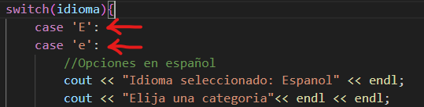

# Manual personal de C++
## Índice 

1. [Instalación](#id1)
2. [Primer progrma](#id2)
3. [Elementos de un programa](#id3)
4. [Tipos de datos y varibles](#id4)
5. [Introducir dato desde la terminal](#id5)
6. [Constante](#id6)
7. [Array](#id7)
8. [Array bidimensional](#id8)
9. [Arrays multidimensionales](#id9)
10. [Vectores](#id10)
11. [Operadores](#id11)
12. [Convenciones](#id12)
13. [Condicional If](#id13)
14. [Bucles](#id14)
15. [Bucle For](#id15)
16. [Bucle For-Each](#id16)
17. [Bucle While](#id17)
18. [Bucle Do-Wile](#id18)
19. [Intruccione break](#id19)
20. [Intruccion continue ](#id20)
21. [Bucles infinitos](#id21)
22. [Bucles anidados](#id22)
23. [](#id23)
24. [](#id24)
25. [](#id25)
26. [](#id26)
27. [](#id27)
28. [](#id28)
29. [](#id29)
30. [](#id30)


## Instalación <div id="id1"></div>
Necesitamos instalar la extension de C/C++ de VScode

Si utilizamos windows necesitamos instalar el compilador.

Comprobar si tenemos instalado el compilador y que versión.

El compilador que tenemos que instlar es: **MinGW-w64**
Nos dirigimos a la página oficial. 
[https://www.mingw-w64.org/](https://www.mingw-w64.org/) 
Descargas. 

Tenemos que instalr el programa MSYS2.

Seleccionamos la opción: MSYS2
Descargamos el instalador y lo ejecutamos.

Se nos acaba de instalar un entorno unix junto con el compilador gcc
En la terminal que acabamos de instalar. 

Vamos a instalar el compilador gcc.
copiando el siguiente comando:

`
pacman -S mingw-w64-ucrt-x86_64-gcc
`

Ya lo tendriamos instalado.


Acontinuación tenemos que actualizar los paquetes. 
Cerramos esta terminal y abrimos la terminal MSYS2 MSYS buscandola en el menu de windows.

Introducimos el comando: 

`
pacman -Suy
`

Seguido del comando: 

`
pacman -S --needed base-devel mingw-w64-x86_64-toolchain
`

Nos da la opctión de seleccionar que queremos instalar. 
En nuestro caso vamos a seleccionar todos introduciendo enter.


Ya hemos terminado de instalr todo.

Cerramos la terminal y la volvemos a abrir.

Comprobamos la versión instalada.


Esto no significa que no esté instalado. Si no que no está añadido al path. Es decir, no sabe donde está este programa. 

Nos dirijimos en el explorador de archivos a: Este esquipo / Windows (C:) / msys64  / mingw64 / bin 

Aqui se encuentra g++

Copiamos esta ruta: C:\msys64\mingw64\bin

En el buscador de windows ponemos: path

Abrimos: Editar las varibles de entorno del sistema

Opciones avanzadas -> varibles de entorno

En path editamos


Pulsamos en nuevo

Pegamos la ruta anterior y aceptar. 

Al comprobar de nuevo la versión.

Con esto ya hemos finalizado completamente la instalación del compilador gcc.


## Primer progrma <div id="id2"></div>

Escribimos un Hola mundo.


Pulsamos F1 y escribimos: integrated terminal 


Nos dirigimos a la dirección donde se encuentra nuestro archivo .cpp en la terminal y escribimos:

`
c++ nombre_del_archivo.cpp -o hola_mundo.exe
`

-o significa asignarle una salida.


Acontinuación ejecutamos el ejecutable que se nos ha creado. Introduciendo: 

`
/hola_mundo.exe
`


De esta forma hemos creado, compilado y ejecutado nuestro primer progrma.

### Extensión code runner 

Vamos a instalar una extensión a Visual Studio Code para compilar y ejecutar directamente nuestro código apretando un botón.


Apretando este boton el ejecuta las órdenes de la terminal por nosotros.


## Elementos de un progrma <div id="id3"></div>

```C++
#include <iostream>
using namespace std;

int main()
{
    cout << "Hola mundo" << endl;
    return 0;
}
```

```C++
#include <iostream>
```
Biblioteca

Incluye todo un conjunto de clases y funciones que pueden ser llamadas en el programa. Entre ellas la función count.

```C++
unsing namespace std;
```
Sentencias o declaraciones.
Indica que vamos a utilizar el espacio de nombres std.

En este caso la biblioteca std contiene a la función iostream

**Espacios de nombres**
Conjunto de funciones que contienen una biblioteca.
Sirve para evitar los conflictos de nombres.

```C++
int main()
```
Funcion principal. 
Secuencia de instrucciones que se ejecutan de arriba a abajo.

>Todo progrma empieza a ejecutarse en la primera línea de la función main.
Y termina con la última línea que contienen las llaves de la función main.

```C++
cout << "Hola mundo" << endl;
``` 
Character out. Sacar por consola un mensaje.
**endl** Es un salto de línea.

```C++
return 0;
```
Las funciones siempre nos devuelven un valor. Excepto las funciones del tipo void.

## Tipos de datos y variables <div id="id4"></div>

### Caracteres


Carácteres o enteros pequeños.

Enteros con signo del -128 al 127.

Enteros sin signo del 0 al 255.

### Enteros


Pueden ser sin signo. En este caso el valor se duplica.

### Decimales


Por ejemplo en un floal son: 38 decimales a la derecha y 38 decimales a la izquierda.

### Booleanos

Se puede sustituir por 0 o 1.

### Variable

Espacio en la memoria donde se almacena un valor que puede variar.

Se almacena en la memoria RAM. 
Al apagar el ordenador se borra.

>C++ Es un lenguaje fuertemente tipado.

Es necesario especificar de que tipo es esa variable.

Las variables siempre se deben declarar antes de utilizarlas.

### Eemplo

Para declarar una variable. 2 opciones.


Primero declarar la varible.

Lego inicializarla (Asignarle un valor).

Útil si en el momento de declararla todavía no tenemos claro que valor le vamos a asignar.


O declararla e inicializarla a la vez.


En este ejemplo se ve como el flujo del progrma va de arriba a abajo.

**C++ es case sensitive.**

Es decir, la variable **C**asa y **c**asa, son dos varibles diferentes. Afectan las mayusculas y minúsculas al nombre de la variable. 

## Introducir dato desde la terminal <div id="id5"></div>
El usuario da un valor a una variable a través de la consola.

```c
cin >> salario;
```


primero declaramos la varibale entero salario, Sin darle un valor (inicializarla).

Porsteriormente asignamos el valor a través de la la función **cin**, escribiendo el valor en la consola y pulsando enter.

## Constante<div id="id6"></div>
Una constante almacena un valor que **no puede cambiar.**

Se deben declarar e inicializar al mismo tiempo.

Tipos de constantes:

### Literales

**Expresiones o secuencias de escape**

**/n** Salto de línea

**/t** Tabulación

**/b** Espacio horizontal

### Declaradas
Dispone de la palabra reservada const
```C++
Const double iva = 0.21;
```
### Expresiones constanstes 

### Constantes enumeradas

### Definidas
Uso obsoleto.

```c++
#define double iva = 0.21;
```


## Array<div id="id7"></div>
Estructura que contienen varios valores del mismo tipo.

Almacena valores que tienen algo en común.

Una vez declaramos el array, no podemos modificar el número de elementos que contiene. Pero si el valor de cada uno de ellos.

### Declaración e inicialización

Varias formas:


```c++
int mi_array [5]{15,25,8,-7,92};
```

Array de enteros, de longitud 5 y con estos valores: **15 25 8 -7 92**

```c++
int mi_array [5]{15,25};
```

Array de enteros, de longitud 5 y con estos valores: **15 25 0 0 0**

```c++
float mi_array [5]{2.5};
```

Array de floats, de longitud 5 y con todos los valores iguales: **2.5 2.5 2.5 2.5 2.5**

```c++
int mi_array []{2,7,8,7,5,1};
```
No indicamos la longitud del array. Esta es tomada de la cantidad de valores introducidos.

Array de enteros, de **longitud 6** y con estos valores: **2 7 8 7 5 1**

### Declaración e inicialización por separado

El array empieza en la posición 0.


```c++
// Declaración
int mi_array [5];

//Almacenamiento
mi_array[0]=15;
mi_array[1]=28;
mi_array[2]=8;
mi_array[3]=-7;
mi_array[4]=92;
```

Para acceder al los valores de las diferentes posiciones:

```c++
//Acceso
mi_array[0];
mi_array[1];
mi_array[2];
mi_array[3];
mi_array[4];
```

### Sobrescritura
Modificación del valor de un elemento del array. Siempre introduciendo un valor del mismo tipo que el array.

```c++
mi_array[4]=88;
```
## Array bidimensional<div id="id8"></div>

Array que en cada una de su posición se desdobla e incluye otro array.
Contiene dos índices.
#### Array mono dimensional

#### Array bidimensional


### Declaración e inicialización 

Dos formas.

```c++
int mi_array[4][5]={15,25,8,-7,92,77,12,11,7,44,56,59,43,78,12,43,95,12,87,33};
```
```c++
int mi_array[4][5]={
    {15,25,8,-7,92},
    {77,12,11,7,44},
    {56,59,43,78,12},
    {43,95,12,87,33}
    };
```
Multiplicamos los íncides para obtener el número de elementos que contiene ele array.
4 x 5 = 20.

### Almacenamiento individual 

```c++
//Almacenamiento
mi_array[0][0]=15;
mi_array[0][1]=25;
mi_array[0][2]=8;
mi_array[0][3]=-7;
mi_array[0][4]=92;
```
Previamente tenemos que declarar el array.

### Acceso

```c++
//Acceso
mi_array[0][0]
```

Normalmente, el array bidimensional se declara y su contenido es escrito mediante dos bucles for anidados. 
Uno recorre las filas y otro las columnas.

En el siguiente ejemplo. Introducimos un array por consola, para finalmente imprimirlo en pantalla.

```c++
#include <iostream>
using namespace std;

int main (){
    //Declaración del array bidimensional
    int array_bidimensional[3][3];

    cout << "Introduce cada valor" << endl ;

    //Dos bucles for anidados para introducir los valores por consola
    for (int fila=0; fila<3; fila++){
        for (int columna=0; columna<3; columna++){
            cin >> array_bidimensional[fila][columna];
        }

    }
    cout << "Array bidimensional introducido:" << endl ;

    //Dos bucles for anidados para imprimir los valores 
    for (int a=0; a<3; a++){
        for (int b=0; b<3; b++){
            cout<< array_bidimensional[a][b]<< " ";
        }
        cout<< endl;

    }
}
```


## Arrays multidimensionales<div id="id9"></div>

Arrays de multiples dimensiones.

Un ejemplo de su uso:

Registrar los coches que pasan por un punto en cada hora a lo largo de todo un año.

```c++
#include <iostream>
using namespace std;

int main(){

    //Declaración del array tridimensional
    int paso_coches[24][31][12]; // Hora, dia, mes

    //Almacenamiento de un valor 
    paso_coches[7][20][5]=500;

    //Acceso 
    cout << "Valor: "<<  paso_coches[7][20][5];
}
```

Mediante esta estructura de 3 bucles for anidados podemos completar todo el array de numeros aleatorios del 0 al 1000.

```c++
#include <iostream>
using namespace std;

int main(){

    //Declaración del array tridimensional
    int paso_coches[24][31][12]; // Hora, dia, mes

    //Almacenamiento de valores aleatorios para todo el array
    for (int i=0; i<24; i++){

        for (int j=0; j<31; j++){

            for (int z=0; z<31; z++){

                paso_coches[i][j][z]= rand ()%1000;
            }
        }
        
    }

    //Acceso 
    cout << "Valor: "<<  paso_coches[7][20][5];
}
```
Si por error accedemos a un valor fuera de los límites del array. Por ejemplo: 


El programa no cae y nos devuelve un valor fuera de límites.


C++ confia en que el programador no se equivoque. 

Este error se puede solucionar con el apartado siguiente.

## Vectores<div id="id10"></div>
Muy parecido a los arrays.

Es una clase de la librería estándar de C++.

Crea estructuras contenedoras para almacenar datos de formas secuencial.

Pueden crecer o decrecer de tamaño de forma dinámica a diferencia de los arrays.

Proporcionan múltiples métodos para chequear límites, tamaño, comprobar si existe un elemento, etc.

Almacenan los valores en posiciones contiguas de la memoria y también en posiciones separadas accesibles a través de punteros.

### Declaración 
Declaración de dos vectores de diferente tipo.

```c++
#include <iostream>
#include <vector> //Necesario incluir la libreria vector
using namespace std; 

int main(){

    //Declaración del vector 
    vector <int> numeros;
    
    vector <char> letras;
}
```
Es imprescindible incluir la libreria vector.

También podemos asignar un tamaño al vector al declararlo. Pero no es necesario. Ya que el tamaño es dinámico. Se ajustará automáticamente.

```c++
#include <iostream>
#include <vector> //Necesario incluir la libreria vector
using namespace std; 

int main(){

    //Declaración del vector 
    vector <int> numeros(5); //5 datos de tipo entero
    
    vector <char> letras(7); //7 datos de tipo caracter 
}
```
De momento, al no haberle asignado valores al los vectores. El vector tipo int almacena 0 en todas sus posiciones. Y el tipo char almacena valores indeterminados.

### Acceso

Recorremos dos dos vectores con un bucle for.

```c++
#include <iostream>
#include <vector> 
using namespace std; 

int main(){

    //Declaración del vector 
    vector <int> numeros(5);

    vector <char> letras(7);

    //Recorrido de vectores
    for (int i=0; i<5;i++){
        cout << numeros[i] << endl;
    }
    for (int j=0; j<5;j++){
        cout << letras[j] << endl;
    }
}
```


Da como resultado 5 ceros y 7 carácteres indeterminados.

### Declarar e inicializar 

```c++
vector <int> numeros{1,2,3,4,5,6};
vector <char> letras{'a','b','c','d'};
``` 
Los carácteres van entre comillas simples.

### Declarar e inicializar con el mismo valor

```c++
vector <double> salario_base(350, 1500.50);
```
Este vector tiene 350 posiciones, todas con el mismo valor.

### Bucle While
La mayoría de veces no sabemos cuantos elementos tiene un vector. Por su tamaño varible. 

Por lo que debemos utilizar un bucle while para recorrerlo. Ya que se trata de un bucle indeterminado.

```c++
#include <iostream>
#include <vector> 
using namespace std; 

int main(){

    vector <double> salario_base(11, 1500.50);

    int i=0;

    while (i<salario_base.size()){   //Método de la libreria vector para tomar el tamaño

        cout << salario_base[i] << endl;

        i++; // Al terminar la lectura incrementar el valor de i
    }
}
```


### Escritura de valores 

Utilizaremos dos métodos:
* at()
* push_back()

Estos métodos estan pensados para trabajr con los vectores dinámicamente (ya que cambian de tamaño).

Si accedemos a una posición fuera de límites obtendremos un valor indeterminado.

Como en el siguiente ejemplo accediendo a la posición **700**.

```c++
#include <iostream>
#include <vector> 
using namespace std; 

int main(){

    vector <int> numeros{1,2,3,4,5};
    
    cout << numeros[3] << endl;
    cout << numeros[700] << endl;
}
```


### Método at()
Nos devuelve un valor del vector y además **comprueba si la posición se encuentra entre los límites del vector**.
```c++
#include <iostream>
#include <vector> 
using namespace std; 

int main(){

    vector <int> numeros{1,2,3,4,5};
    
    cout << numeros.at(3) << endl;
    cout << numeros.at(700) << endl;
}
```

En este caso. La posición si se encuentra entre los límites y se imprime el valor. 

Pero la posición 700 no se encuentra entre los límites. Por lo que el programa lanza una **excepión**.

Además el método at() se utiliza para escribir un valor.

```c++
#include <iostream>
#include <vector> 
using namespace std; 

int main(){

    vector <int> numeros{1,2,3,4,5};  //Declaración e inicialización
    
    numeros.at(3)=40;  //Sobreescritura

    cout << numeros.at(3) << endl; //Lectura
}
```


También me lanzará una excepción si intento escribir en una posición fuera de límites.

```c++
numeros.at(3)=40;
```
### Método push_back()
Almacena un valor mas e incrementa en uno el tamaño del vector.
```c++
#include <iostream>
#include <vector> 
using namespace std; 

int main(){

    vector <int> numeros{1,2,3,4,5};  

    numeros.push_back(80);

    int i =0;

    while (i<numeros.size())
    {
        cout << numeros.at(i) << endl;
        i++;
    }
}
```


## Operadores<div id="id11"></div>

### Asignación


El operador += se utiliza para sumar dos variables sin ser necesario declarar una tercera variable para alojar el resultado de la operación.

```c++
#include <iostream>
using namespace std; 

int main (){
    int a = 1;
    int b = 2;

    b+=a; //Operador +=

    cout << b;
}
```
El mismo funcionamiento para los demás operadores.

### Aritméticos 

* **%** Módulo o residio. Resto de una divión.
* **a++** Incrementa en uno el valor
* **a--** Disminuye en uno el valor
* **++a** Incrementa en uno el valor
* **--a** Disminuye en uno el valor

Aunque realizan la misma función, se diferencian en el **momento en el que asignan el valor**.

#### Preincremento 
```c++
#include <iostream>
using namespace std; 

int main (){

    int a = 1;
    int b=++a;

    cout <<"a = "<< a << endl;
    cout <<"b = "<< b << endl;
}
```


Primero se incrementa el valor de la variable A.
Posteriormente se asigna el valor de la variable A a B.

A la variable b se le asigna el valor ya incrementado de a.

#### Postincremento
```c++
#include <iostream>
using namespace std; 

int main (){

    int a = 1;
    int b=a++;

    cout <<"a = "<< a << endl;
    cout <<"b = "<< b << endl;
}
```


Primero es asignado el valor de A en B, y posteriormente se incrementrá el valor de la variable A.

Mismo funcionamiento para los decrementos.

### Conversiones de tipos 
Al realizar una operación entre variables de diferente tipo, en la variable resultado se realiza una conversión del tipo.
Conversiones implícitas.


> **El tipo de dato del resultado será el tipo de dato más amplio.**


```c++
#include <iostream>
using namespace std; 

int main (){

    int a = 3;
    float b= 2.5f;
    double c = 8.0;

    auto resultado = b+c; //con auto se le asigna el tipo que mejor se le ajuste automáticamente a la variable 

    cout << typeid(resultado).name(); //devuelve la primera letra del tipo de la variable
}
```
En este caso, imprime una f.

Por ejempo. Vamos a realizar la media aritmética de 3 valores.

```c++
#include <iostream>
using namespace std; 

int main (){
    // todas las variables enteras
    int a = 10;
    int  b= 12;
    int  c = 30;

    auto resultado = (a+b+c)/3; 

    cout << resultado << endl << typeid(resultado).name(); 
}
```


En este caso nos devuelve como resultado un entero. Por lo que esta operación es incorrecta. Ya que el resultado real de la media es un número decimal.

```c++
#include <iostream>
using namespace std; 

int main (){

    int a = 10; //entero
    int  b= 12; //entero
    float  c = 30; //decimal 

    auto resultado = (a+b+c)/3; 

    cout << resultado << endl << typeid(resultado).name(); 
}
```


Este resultado si es el correcto. Ya que la variable resultado **toma el tipo de variable mas preciso.** En este caso float.

### Comparación


Sobretodo se utilizan para el control de condicionales y bucles.

### Operadores lógicos


Se pueden concatenar comparaciones.

```c++
if (calificacion > 8 || (distancia>28 && ingreso < 2000) ){

}
```
En este caso, para que se ejecute el código del if, calificación debe de ser superior a 8, o que se cumplan las otras dos condiciones a la vez.

## Convenciones <div id="id12"></div>
Recomendaciones para nombrar diferentes elementos en C++.


## Condicional If <div id="id13"></div>
```c++
if(){

}
```
```c++
if(){

}
else{

}
```
## Condicional switch-case
Útil para cuando tenemos que evaluar muchas condiciones a la vez.

Podríamos llegar al mismo resultando concatenando muchos if else. Pero esta opción es mucho más cómoda.

```c++
switch (variable){
    case valor1:
        //Bloque de código para este caso
        break;

    case valor2:
        //Bloque de código para este caso
        break;
    default:
        //Bloque de código para cuando no se cumpla ninguna de los casos anteriores
}
```
**No es posible utilizar switch-case para comparar floats o strings.**

Utilizar switch-case para que el usuario elija el funcionamiento de un progrma.

```c++
#include <iostream>
using namespace std; 

int main (){

    int opcion;

    cout << "MENU"<< endl << endl;
    cout << "1. Mostrar mensaje"<< endl;
    cout << "2. Calcular la suma"<< endl;
    cout << "3. Salir del progrma"<< endl;
    cout << "4. Introduce la opcion deseada (1 , 2 o 3)"<< endl;
    cin >> opcion;

    switch(opcion){
        case 1:
            cout << "Realizar mostrar mensaje" << endl;   
            break;
        
        case 2:
            cout << "Realizar calcular la suma" << endl;   
            break;
        
        case 3:
            cout << "Realizar salir del progrma" << endl;   
            break;

        default:
            cout << "numero introducido incorrecto" << endl;   
    }
}
```


Para un mismo case podemos poner varias condiciones. 


Las siguientes líneas de código se ejecutarán siempre que la variable idioma sea 'e' o 'E'.

Esto puede ser útil en menús para evitar un error al no hacer distinción entre mayúscula y minuscula.

Es posible anidar un switch dentro de otro.


El Switch principal evalua idioma. Y el switch anidado evalua categoría.

### Operador ternario o condicional
Función idéntica a la de la estructura If-Else.

Es recomendable utilizarlo cuando las condiciones son sencillas. Ya que ahorra líneas de código.


Entre paréntesis la condición a evaluar, seguido de un signo de interrogación. 
A continuación, la acción a ejecutar cuando sea verdadero, dos puntos, la acción para cuando sea falso.

Ejemplo. Discriminar si un número es par o impar.

```C++
#include <iostream>
using namespace std; 

int main (){

    int numero;
    cout << "Introduce un mumero" <<endl;
    cin >> numero;
    /*     SENTENCIA IF-ELSE EQUIVALENTE
    if (numero%2 == 0){
        cout << "numero PAR";
    }
    else{
        cout << "numero IMPAR";
    }
    */
   cout << "Numero " << ((numero%2==0)?"PAR":"INPAR");
}
```
En este caso, al incluir el operador condicional en un cout, este ha de ir entre paréntesis. Devido al órden de preferencia de operadores.


## Bucles<div id="id13"></div>
2 tipos. 
* **Determinados**

Antes de ejecutar un progrma, sabemos la cantidad de veces que va a ejecutar el código en su interior.

Suele ser el bucle for.
* **Indeterminados**

No podemos saber la cantidad de veces que va a ejecutar el código en su interior.

Suele ser los bucles while y do-while.
```c++
while (condicion){
    //código
}
```
## Bucle For<div id="id14"></div>
for (Inicialización ; Condición ; Incremento){Cuerpo 
}
```c++
for (int i=0; i<5; i++){
    //código
}
```
Este bucle se ejecuta 5 veces. i=0, i=1, i=2, i=3 e i=4.

## Bucle For-Each<div id="id15"></div>

Utilizado para recorrer colecciones, como los arrays o los contenedores (vector,list,set,map,etc).

**Por cada** elemento de una colección ejecuta un código.

Es ideal para **recorrer contenedores dinámicos**. Crecen o decrecen.

```c++
#include <iostream>
using namespace std; 

int main(){
    int edades[]{25,24,72,2,0};
    
    for(int i:edades){
        cout << i << endl;
    }
}
```


La colección puede crecer todo lo que quiera, que el bucle For-Each le recorrerá de principio a fin.

La limitación es que solo podemos recorrer el array si la variable i del bucle la declaramos con el mismo tipo que el tipo del array.

### Inferencia de tipos
Característica de C++. Permite detectar el tipo de dato de una colección y ajustar el bulcle For-Each a este.

```c++
#include <iostream>
using namespace std; 

int main(){
    int edades[]{25,24,72,2,0};

    for(auto i:edades){  //definimos i como auto
        cout << i << endl;
    }
}
```
Obtenemos el mismo resultado que en el ejemplo anterior. 

Podemos recorrer un string para encontrar si contiene @ un correo electrónico.
```c++
#include <iostream>
using namespace std; 

int main(){
    string email="pedro@gmail.com";

    for(auto i:email){
        cout << ((i=='@')?"Hay @":"no hay") << endl;
    }
}
```


Ejemplo. **Combinación de bucle while y for-each.**
Vamos a introducir por consola los números que el usuario quiera en un vector y luego le vamos a recorrer.

```c++
#include <iostream>
#include <vector>
using namespace std; 

int main(){
    vector <int> numeros;  //Vector a recorrer
    int num; //numeros que vamos introduciendo

    cout << "Intoduce los numeros que quiera y para terminar intoroduce 0"<<endl;

    //Se ejecuta siempre que introduzcamos un número y este sea distinto de 0
    while (cin >> num && num!=0){ 
        //Vamos incrementando el vector con los números introducidos
        numeros.push_back(num);
    }
    
    cout << "Has introducido estos numeros:"<<endl;

    for(auto i:numeros){   //Recorremos el vector
        cout << i << endl;
    }
}
```


## Bucle While<div id="id16"></div>
Bucle indeterminado.
Repite el código un número indeterminado de veces, hasta que se produce una **condición de parada**.

while(condicion){cuerpo}

La condición en cualquier momento, mientras se está ejecutando el código puede cambiar de estado. True o False.

Podemos crear bucles infinitos.

Ejemplo. Indicar por consola si un número es par.

```c++
#include <iostream>
using namespace std; 

int main(){

    int numero{2};

    while (numero<10){  //Se esjecuta siempre que número sea menor que 10
        if (numero%2==0){
            cout << numero << " Es par"<<endl; 
        }
        
    }
}
```
Como la condición del bucle while siempre será verdadera. Entra el progrma en un bucle infinito.


Para solucionar esto. Por ejemplo, incrementamos el valor de num a cada vuelta de ejecución. 
Entoncess, se ejecutará el mensaje hasta que num llegue a 10.
Saliendo del bucle y terminado el programa.

```c++
#include <iostream>
using namespace std; 

int main(){

    int numero{2};

    while (numero<10){  //Se esjecuta siempre que número sea menor que 10
        if (numero%2==0){
            cout << numero << " Es par"<<endl; 
        }
        numero++; //Incremento a cada vuelta
    }
}
```


Ejemplo: Introducir una lista de numeros indetreminada y hacer la suma de estos.
```c++
#include <iostream>
#include <vector>;
using namespace std; 

int main(){
    vector <int> numeros;
    int num;
    int suma=0;

    cout << "Introduzca los numeros menores que 20. Para terminar introduzca 0."<<endl;
    cin >> num;

    //Cuando el num introducido valga 0 o sea mayor que 20 sale del bucle
    while(num!=0 && num<20){
        cout << "Numero introducido: "<< num <<endl;
        numeros.push_back(num); //Metemos el valor en el vector 
        suma=suma + num;  //Realizamos la suma hasta el momento

        cin >> num; //volvemos a preguntar por un nuevo número
        //De lo contrario, entraremos en un bucle infinito
    }

    cout << "Los numeros introducidos son:"<<endl;
    //Recorrer todo el vector para imprimir los valores
    for(auto i:numeros){
        cout << i << "  ";
    }

    cout << endl << "La suma es:"<<endl;
    cout <<suma;
}
```

## Bucle Do-Wile<div id="id17"></div>
Mismo funcionamiento que el bucle while. Además, si no se cumplen la condición. Se ejecuta una única vez en toda la ejecución del progrma.

**Nos asegura que se va a ejecutar al menos una vez.**

do {
    cuerpo

}

while(condición);

Por ejemplo. Un menú que disponga de dos opciones y una tercera de salida. Hasta que no selecionemos la salida no salimos del bucle. 

Incluso si introducimos algo diferente a la salida tampoco salimos.

```c++
#include <iostream>
using namespace std; 

int main(){
    int seleccion=0;

    do{
        cout <<"Seleccione una opcion.\n";
        cout <<"1. Opcion 1\n";
        cout <<"2 Opcion 2\n";
        cout <<"3. Salir\n";
        cin >> seleccion;
        if (seleccion==1) cout <<"OPCION 1\n";
        if (seleccion==2) cout <<"OPCION 2\n";
    }
    while (seleccion!=3);

    cout <<"Ha seleccionado salir\n";
    cout <<"Seguimos con el programa\n";
}
```


## Intrucción break<div id="id18"></div>
Al ejecurtarse, sale del bucle sin importar si la condición del bucle se sigue cumpliendo.

Sirve para optimizar el progrma. Ahorrar recursos del sistema.

Ejemplo. Vamos a recorrer un vector de nombres para en contrar uno en concreto.
```c++
#include <iostream>
#include <vector>
using namespace std; 

int main(){

vector<string>nombres{"Maria","Luisa","Juan","Pedro","Paco"};
string busqueda = "Luisa";

for (int i=0;i<nombres.size();i++){
    cout <<"Lectura de la posicion "<<i<<endl;

    if(nombres[i]==busqueda){
        cout << "Nombre: "<<nombres[i]<<"encontrado. En la posicion "<<i<<endl;
        //break;
    }
}

cout <<"Continua el progrma\n";
}
```

con el break comentado. Encuenta el nombre, pero sigue recorriendo el vector.

Incluyendo el break. Al encontrar el nombre, salimos del bubucle.

## Intrucción continue <div id="id19"></div>
Al ejecutarse, el bucle deja de ejecutar las acciones para el valor en el que se encuentra y salta al siguiente valor.

Ejemplo. Recorrer numeros del 1 al 5 saltandonos el número 3.
```c++
#include <iostream>
using namespace std; 

int main(){
    for(int i=0; i<6; i++){
        if(i==3){
            continue;
        }
        cout<< i <<endl;
    }
}
```


Otro ejemplo más práctico. En un vector con precios. Aplicar un descuento a los precios superiores a 100.
```c++
#include <iostream>
#include <vector>
using namespace std; 

vector<float>precios{50,60,200,100,40,300};
float descuento = 0.20; 
float precio_final;

int main(){
    cout << "Precios con descuentos \n\n";

    for(int i=0; i<precios.size(); i++){
        if(precios[i]<100){ //Siempre que el precio sea menor que 100 salimos de esta vuelta del bucle
            continue;
        }
    
        
        precio_final=precios[i]-(precios[i]*descuento);

        cout<< "El precio: " << precios[i]<<" se queda en: "<<precio_final<<endl;
    }
    cout << "Continua el programa";
}
```


## Bucles infinitos<div id="id20"></div>
En la mayoría de ocasiones se considera un error. El progrma queda atascado.

Hay escenarios en los que pueden ser necesario. Aplicaciones que deban ejecutarse constantemente. 

Por ejemplo un chat. Sistemas que quedan a la espera de que interactue el usuario con ellos.

Dos formas de realizar bucles infinitos.

```c++
for(;;){
}
```
```c++
while(true){
}
```
Por ejemplo. Reproducir la medida de un sensor cada 3 segundos en todo momento. Y que cuando supere la temperatura un valor determinado, mande una alerta.

Para ello es necesario utilizar algunas funciones de C++ que por el momento no conocemos.

```c++
#include <iostream>
#include <thread> //libreria hilos
#include <chrono> //libreria chrono
using namespace std;  

double leerTemperatura(){ //Funcion crear valores de temperatura 
    //Es double, porque el retorno es un valor double
    return 20.0 + (rand() % 20); //A 20 le sumo un número aleatorio entre 0 y 19.9999999(el 20 no está incluido en la experesión). 
    //Por lo que la lectura será de 20 a 40.
}

void esperarSegundos(int segundos){ //Funcion pausar el hilo de ejecucion
    this_thread::sleep_for(chrono::seconds(segundos));
}


int main(){
    const double limiteTemperatura = 35.0;

    for(;;){
        
        double temperaturaActual = leerTemperatura(); //Asignamos la temperatura de lectura a la función 
        cout << "Temperatura actual: "<<temperaturaActual<< " grados"<<endl;
        if(temperaturaActual>limiteTemperatura){
            cout << "ALERTA !!! Temperatura maxima alcanzada. "<<temperaturaActual<<" grados"<<endl;
        }
        esperarSegundos(3); //pausamos el hilo de ejecución 3s
    }
}
```


## Bucles anidados<div id="id21"></div>
Combinaciones multiples de bucles unos dentro de otros.

Casos de uso:

* Recorridos de arrays y vectores multidimensionales
* Generar combinaciones 
* Simulación de combinaciones
* Fuerza bruta
* Renderizado grágico
* Juegos 
* Ordenamiento
* Operaciones con cadenas
* Creación de entornos gráficos

Ejemplo. Imprimir en pantalla las tablas de multiplicar.

```c++
#include <iostream>
using namespace std;  
int main(){
    for(int i=0;i<11;i++){  //eje i
        for(int y=0;y<11;y++){ //eje y
        int resultado=i*y;
        cout << i <<" X "<<y<<"= "<<resultado<<endl;
        }
        cout << endl;
    }
}
```


Y continua hasta la del 10.

## <div id="id22"></div>
## <div id="id23"></div>
## <div id="id24"></div>
## <div id="id25"></div>
## <div id="id26"></div>
## <div id="id27"></div>
## <div id="id28"></div>
## <div id="id29"></div>
## <div id="id30"></div>